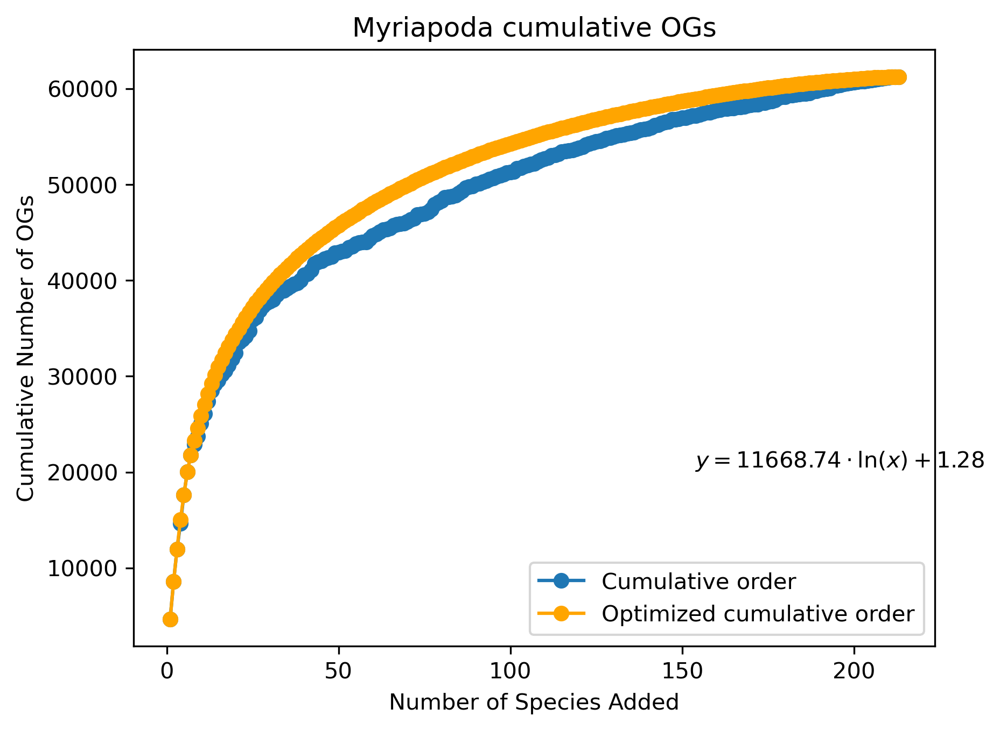
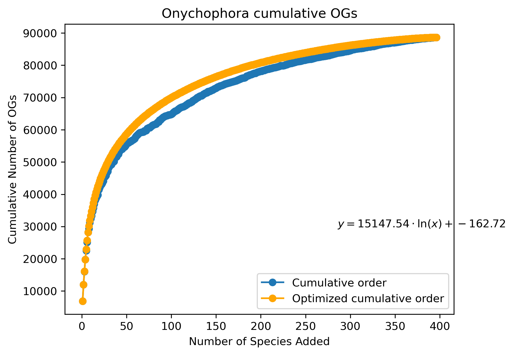

## 1. Description

.

## 2. Files in this repository

## 3. Workflow

### GO enrichment analyses

Once we have identified the nodes of terrestrialization and the OGs that were gained and lost there, let’s see the functions of those genes.

To obtain the GO terms, the strategy will differ for gains and losses. To avoid doing any meta-analysis of GO enrichments (for clades with few species it’s not a big issue but for others, like arthropods, we will avoid having to do hundreds of enrichments), we will do GO enrichments focusing on just one (or two) species per each of the nodes we are interested in. There are 2 problems here:

- For gains, some OGs may have been lost for the selected species. Here, we could complement by analyzing other species until we cover all OGs.
- For losses, we can’t use species that descend from that node to do the analyses. We will select species from the sister lineage. As before, it is possible that some of these OGs could have also been lost afterward in the sister lineage, so we will complement with other species until we get everything.

One way to solve the species selection problem is to sort the species by presence in OGs (from the species that has genes in more OGs to the least) and maximize the selection of species that cover all OGs. First, we will select the one with genes in more OGs, and then include the following ones until we cover all OGs. I would try to avoid selecting more than 3 species, but let’s see later what we get.

- Functions to get presence-absence species-OG table from counts and select the 2-3 species that we will use for a list of OGs
    
    ```python
    import pandas as pd
    
    sp_ogs_table_file="/mnt/netapp2/Store_csbyegim/Metazoa_OGs/ortholog_groups/ortholog_counts_per_species.stats.tsv"
    
    # Function to check if DataFrame is binarized
    def is_binarized(df):
        return df.isin([0, 1]).all().all()
    
    # Function to binarize DataFrame
    def binarize(df, threshold=1):
        return (df >= threshold).astype(int)
    
    #Function to select the minimum number species given the sorted OGs-species table and list of OGs
    def select_minimal_columns(sp_ogs_table_sorted, ogs_list):
        cumulative_count_ogs = set()  # Keep track of unique OGs
        remaining_columns = list(sp_ogs_table_sorted.columns)  # All columns to start with
        selected_columns = []  # List to store selected columns
        while len(cumulative_count_ogs) < len(ogs_list) and remaining_columns:
            # Find the column that contributes the most new OGs
            best_column = None
            max_new_ogs = 0
            for col in remaining_columns:
                species_ogs = set(sp_ogs_table_sorted[col][sp_ogs_table_sorted[col] > 0].index)
                new_ogs = len(species_ogs - cumulative_count_ogs)  # New OGs contributed by this column
                if new_ogs > max_new_ogs:
                    best_column = col
                    max_new_ogs = new_ogs
            # If no new OGs are contributed, stop early
            if best_column is None or max_new_ogs == 0:
                break
            # Add the best column to the selection
            selected_columns.append(best_column)
            cumulative_count_ogs.update(
                set(sp_ogs_table_sorted[best_column][sp_ogs_table_sorted[best_column] > 0].index)
            )
            # Remove the selected column from the remaining pool
            remaining_columns.remove(best_column)
        return selected_columns
    
    #Function to get list of species from species-OGs file
    def get_list_sp_given_OGs(sp_ogs_table_file,ogs_list,sp_subset=None,total_column=None,og_name_column=None):
    	"""
    	Given an OGs-species file and a list of OGs, obtain the species (one or more) that contain all OGs.
    
    	Args:
    		sp_ogs_table_file: File with the OGs-species coutns or presence-absence data. Must be ordered from OG 1 to OG X. First row must contain column headers (one for OGs and another one for species names). If not binary, it will be automatically binarized
    		total_column(optional): name of column that contains the total sum of OGs
    		og_name_column(optional): name of the column that contains the name of OGs. If not provided, first column will be used
    		ogs_list: List of OGs (contained in the sp_ogs_table) to look at
    		sp_subset (optional): List of species to obtain the final selection from. Useful for selecting the species from a specific clade. Names must be the same as found in columns of sp_ogs_table_file
    
    	Returns:
    		list: species that contain the list of OGs
    		
    	Raises:
    		ValueError: If species in sp_subset are not contained within the sp_ogs_table
    	"""
    	# Load specific rows (0-indexed). 0 will be the header and the rest the OGs
    	sp_ogs_table = pd.read_csv(sp_ogs_table_file, sep="\t", skiprows=lambda x: x not in [0]+ogs_list)
    	#Remove column for totals (if this column exists in dataset)
    	if total_column:
    		sp_ogs_table = sp_ogs_table.drop(columns=[total_column])
    	#Set column with OGs names as index
    	if not og_name_column:
    		og_name_column=sp_ogs_table.columns[0]
    	sp_ogs_table=sp_ogs_table.set_index(og_name_column)
    	#If sp_subset has been provided, check that they are in sp_ogs_table
    	if sp_subset:
    		if len(set(sp_subset).intersection(set(sp_ogs_table.columns))) != len(sp_subset):
    			raise ValueError("Species provided are not contained in the species-OGs table")
    	#Check if data is binarized. If not, binarize it
    	if not is_binarized(sp_ogs_table):
    		sp_ogs_table = binarize(sp_ogs_table)
    	#Subset sp_ogs_table
    	if sp_subset:
    		sp_ogs_table=sp_ogs_table[sp_subset]
    	#Sort by number of OGs found in species
    	sorted_indices=[index for index, value in sorted(enumerate(sp_ogs_table.sum(axis=0)), key=lambda x: x[1], reverse=True)]
    	sp_ogs_table_sorted=sp_ogs_table.iloc[:, sorted_indices]
    	#Select species that contain all OGs
    	selected_columns=select_minimal_columns(sp_ogs_table_sorted, ogs_list)
    	return selected_columns
    
    #Save the output of get_list_sp_given_OGs into a file
    def save_list_sp_file(sp_list, out_file):
    	sp_list=list(sp_list)
    	with open(out_file,"wt") as f:
    		for sp in sp_list:
    			f.write(sp+"\n")
    ```
    
- Script to extract a list of GO terms given a list of OGs and a list of species (obtained using previous functions and saved into a file)
    ```bash
    WD=$STORE2/Metazoa_OGs
    LIST_OF_OGs=$1
    OUT_DIR=$2
    LIST_OF_SPECIES=$3
    CONVERSION_FILE=$WD/species_conversion.txt #In first column must have species name as specified in the gene-species file of each OG. Second column is species code
    INFO=$4 #Extra info to add to output file names
    TOPGO_INPUT_DIR=$WD/go_enrichment/genes_annotated_gopredsim
    GOPREDSIM_DIR=$SHARE/Drago_backup/longest_isoforms_gopredsim_prott5
    TOPGO_INPUT_SCRIPT_PATH=$STORE2/Dark_proteome/GO_enrichment
    
    #Get subset species conversion file
    LIST_OF_SPECIES_CONVERSION=$OUT_DIR/subset_sp_conversion.txt
    grep -wf $LIST_OF_SPECIES $CONVERSION_FILE > $LIST_OF_SPECIES_CONVERSION
    
    #Get sequences for the enrichment
    #Get sequences for the enrichment
    while read -r LINE
    do
            #Get species name
            SP_ORIG_FILENAME=$(echo $LINE | awk '{print $1}')
            SPECIES=$(echo $LINE | awk '{print $2}')
            #Get sequences given a list of OGs for that species
            while read -r OG; do
                awk -v og_name="$OG" -v species_name="$SP_ORIG_FILENAME" -v out_file="$OUT_DIR/${SPECIES}_subset_genes_${INFO}_nums.txt" '
                    NR == 1 {
                        for (i = 2; i <= NF; i++) {
                            if ($i == species_name) col = i;
                        }
                    }
                    $1 == og_name && col && $col != "*" {
                        split($col, genes, ",");
                        for (gene in genes) print genes[gene] >> out_file;
                    }
                ' "$SONICPARANOID_OGS"
            done < "$LIST_OF_OGs"
            #Get subset gene names (same as in gopredsim output)
            grep -wf $OUT_DIR/${SPECIES}_subset_genes_${INFO}_nums.txt $WD/SequenceIDs.txt | cut -f2 -d" " > $OUT_DIR/${SPECIES}_subset_genes_$>
            #Get FANTASIA annotations
            cp $FANTASIA_DIR/${SPECIES}_fantasia_topgo.txt.gz $OUT_DIR/${SPECIES}_topGO_input_${INFO}.txt.gz
            gzip -d $OUT_DIR/${SPECIES}_topGO_input_${INFO}.txt
            #Get gene list for topGO
            cut -f1 $OUT_DIR/${SPECIES}_topGO_input_${INFO}.txt > $OUT_DIR/${SPECIES}_genelist_${INFO}.txt
    done < $LIST_OF_SPECIES_CONVERSION
    ```
    

### GO enrichment of OGs gained

For gene gains we need to obtain the list of OGs of interest; i.e. the OGs that were gained at the node(s) of interest. So, let’s first create the working directory.

```bash
mkdir /mnt/netapp2/Store_csbyegim/Metazoa_OGs/go_enrichment/gene_gain
```

Now, we need a script to obtain this OGs list given their age of origin.

- Script for obtaining the OGs lists at terrestrialization nodes
    
    ```python
    import pickle
    from ete3 import PhyloTree
    
    wd_path="/mnt/netapp2/Store_csbyegim/Metazoa_OGs/"
    out_path="/mnt/netapp2/Store_csbyegim/Metazoa_OGs/go_enrichment/gene_gain/"
    og_age_file=wd_path+"OG_age.pickle"
    sp_tree_file=wd_path+"metazoa_sp_tree_node_names.nwk"
    
    #Load species tree
    sp_tree=PhyloTree(sp_tree_file, format=1)
    
    #Load OG-age data
    with open(og_age_file,"rb") as f:
    	og_age=pickle.load(f)
    
    #Interesting nodes (terrestrialization)
    terr_nodes={1357: "Hexapoda",
    1820: "Anomura",
    1918: "Brachyura",
    1597: "Isopoda",
    "TRLO1": "TRLO1",
    1119: "Myriapoda",
    1121: "Arachnida",
    1060: "Onychophora",
    "ETES1": "ETES1",
    "RVAR1": "RVAR1",
    1084: "Tardigrada",
    "PPUN2": "PPUN2",
    "ANGR1": "ANGR1",
    1239: "Rhabditida",
    1806: "Stylomatophora",
    1835: "Ellobiida",
    "OVER1": "OVER1",
    "PELE1": "PELE1",
    1865: "DRAW1_PELO1_Crassi",
    1887: "PELO1_Crass",
    1908: "Crassiclitellata",
    "CYCO1": "CYCO1",
    "ECRY2": "ECRY2",
    "HRPE1": "HRPE1",
    "PHEI1": "PHEI1",
    1395: "Acteonemertidae",
    1617: "Geoplanidae",
    1145: "Tetrapoda"}
    
    #Get list of OGs that originated at each age
    age_og={}
    for OG in og_age:
    	node=og_age[OG]
    	if node not in age_og:
    		age_og[node]=[OG]
    	else:
    		age_og[node].append(OG)
    """
    for OG in og_age:
    		species=og_age[OG].get_leaf_names()
    		if len(species)>1:
    			node=sp_tree.get_common_ancestor(species).name
    		else:
    			node=species[0]
    		if node not in age_og:
    			age_og[node]=[OG]
    		else:
    			age_og[node].append(OG)
    """
    
    with open(wd_path+"age_OG.pickle","wb") as f:
    	pickle.dump(age_og,f,pickle.HIGHEST_PROTOCOL)
    
    with open(wd_path+"age_OG.txt","wt") as f:
    	for age, OG in age_og.items():
    		f.write(f"{age}\t{OG}\n")
    
    #Get list of OGs that originated at the interesting nodes
    for node in terr_nodes:
    	ogs=age_og[str(node)]
    	node_name=terr_nodes[node]
    	with open(out_path+node_name+"_ogs.txt","wt") as f:
    		for og in ogs:
    			f.write(str(og)+"\n")
    ```
    

Then, we can execute the previous scripts to get the files we need for the GO enrichment.

- Script for getting the list of species given the list of OGs gained at terrestrialization nodes
    
    ```python
    from get_sp_from_ogs import *
    import pandas as pd
    
    wd_path="/mnt/netapp2/Store_csbyegim/Metazoa_OGs/go_enrichment/gene_gain/"
    
    #Interesting nodes (terrestrialization)
    terr_nodes={1357: "Hexapoda",
    1820: "Anomura",
    1918: "Brachyura",
    1597: "Isopoda",
    "TRLO1": "TRLO1",
    1119: "Myriapoda",
    1121: "Arachnida",
    1060: "Onychophora",
    "ETES1": "ETES1",
    "RVAR1": "RVAR1",
    1084: "Tardigrada",
    "PPUN2": "PPUN2",
    "ANGR1": "ANGR1",
    1239: "Rhabditida",
    1806: "Stylomatophora",
    1835: "Ellobiida",
    "OVER1": "OVER1",
    "PELE1": "PELE1",
    1865: "DRAW1_PELO1_Crassi",
    1887: "PELO1_Crass",
    1908: "Crassiclitellata",
    "CYCO1": "CYCO1",
    "ECRY2": "ECRY2",
    "HRPE1": "HRPE1",
    "PHEI1": "PHEI1",
    1395: "Acteonemertidae",
    1617: "Geoplanidae",
    1145: "Tetrapoda"}
    
    #Read species-OGs table
    sp_ogs_table_file="/mnt/netapp2/Store_csbyegim/Metazoa_OGs/ortholog_groups/ortholog_counts_per_species.stats.tsv"
    
    #For each node, get list of species and save info
    for node_name in terr_nodes.values():
    	ogs_list=list(pd.read_csv(wd_path+node_name+"_ogs.txt",header=None)[0])
    	sp_list=get_list_sp_given_OGs(sp_ogs_table_file,ogs_list,total_column="total",og_name_column="Group_ID")
    	save_list_sp_file(sp_list, wd_path+node_name+"_sps.txt")
    ```

| Terrestrialization event | Node | # Gains | # Species for GO enrichment |
| --- | --- | --- | --- |
| Hexapoda | 1357 | 305 | 10 |
| Anomura (Coenobitidae) | 1820 | 537 | 1 |
| Brachyura (Gecarcinidae) | 1918 | 85 | 1 |
| Isopoda | 1597 | 380 | 1 |
| TRLO1 (Amphipoda) | TRLO1 | 16 (+6319) | 1 |
| Myriapoda | 1119 | 461 | 5 |
| Arachnida | 1121 | 630 | 14 |
| Onychophora | 1060 | 2341 | 10 |
| ETES1 (tardigrade) | ETES1 (tardigrade) | 3 (+8775) | 1 |
| RVAR1 (tardigrade) | RVAR1 (tardigrade) | 18 (+7486) | 1 |
| Macrobiotidae + Richtersiidae | 1084 | 290 | 1 |
| PPUN2 (nematode) | PPUN2 | 16 (+7187) | 1 |
| ANGR1 (nematode) | ANGR1 | 9 (+8520) | 1 |
| Rhabditida | 1239 | 525 | 8 |
| Stylomatophora | 1806 | 158 | 1 |
| Ellobiida (mollusca) | 1835 | 1026 | 1 |
| Onchidiidae (systelommatophora) | OVER1 | 10 (+3277) | 1 |
| Pomatiidae (caenogastropoda) | PELE1 | 3 (+4690) | 1 |
| DRAW1+PELO1+Crassi | 1865 | 323 | 1 |
| PELO1+Crass | 1887 | 278 | 1 |
| Crassiclitellata | 1908 | 527 | 1 |
| CYCO1 (leech) | CYCO1 (leech) | 18 (+1912) | 1 |
| ECRY2 (enchytreid) | ECRY2 (enchytreid) | 30 (+1976) | 1 |
| HRPE1 (annelid) | HRPE1 | 16 (+4391) | 1 |
| PHEI1 (annelid) | PHEI1 (annelid) | 8 (+3235) | 1 |
| Acteonemertidae (nemertea) | 1395 | 197 | 1 |
| Geoplanidae | 1617 | 352 | 6 |
| Tetrapoda | 1145 | 232 | 14 |
- Script for getting topGO input for GO enrichment of OGs gained at terr. nodes
    
    ```bash
    WD="/mnt/netapp2/Store_csbyegim/Metazoa_OGs/go_enrichment/gene_gain/"
    
    for NODE in {"Hexapoda","Anomura","Brachyura","Isopoda","TRLO1","Myriapoda","Arachnida","Onychophora","ETES1","RVAR1","Tardigrada","PPUN2","ANGR1","Rhabditida","Stylomatophora","Ellobiida","OVER1","PELE1","DRAW1_PELO1_Crassi","PELO1_Crass","Crassiclitellata","CYCO1","ECRY2","HRPE1","PHEI1","Acteonemertidae","Geoplanidae","Tetrapoda"}
    do
    	LIST_OF_OGs=$WD/${NODE}_ogs.txt
    	OUT_DIR=$WD
    	LIST_OF_SPECIES=$WD/${NODE}_sps.txt
    	INFO=${NODE}_gained
    	echo $NODE
    	bash /mnt/netapp2/Store_csbyegim/Metazoa_OGs/go_enrichment/obtain_subset_genes_per_sp_and_topgo_input.sh $LIST_OF_OGs $OUT_DIR $LIST_OF_SPECIES $INFO
    done
    ```
    
- GO enrichment for OGs gained at terrestrialization nodes
    
    [go_enrichment_plus_treemap_gene_gain.Rmd](go_enrichment_plus_treemap_gene_gain.rmd)
    

### GO enrichment of OGs lost

The method for obtaining the OGs of interest for gene losses is different from that for gains. But first, let’s create the working directory.

```bash
mkdir /mnt/netapp2/Store_csbyegim/Metazoa_OGs/go_enrichment/gene_loss
```

Now, we need a way to obtain GO terms for the genes that were lost at specific nodes. As we cannot use the species belonging to the clade that originated at that node, we need to use other species. Perhaps the most logical option would be to use species from the sister lineage. The functions may be different in that lineage to the ancestral functions, but this way we minimize the issue of losses in species that diverged before. If the loss is inferred to happen at the clade of interest, it means that at least one species from the sister lineage has genes from this OG.

- Script for obtaining the OGs that were lost at a given age
    
    ```python
    import pickle5 as pickle
    from ete3 import PhyloTree
    
    wd_path="/mnt/netapp2/Store_csbyegim/Metazoa_OGs/"
    out_path="/mnt/netapp2/Store_csbyegim/Metazoa_OGs/go_enrichment/gene_loss/"
    og_loss_file=wd_path+"OG_losses.pickle"
    sp_tree_file=wd_path+"metazoa_sp_tree_node_names.nwk"
    
    #Load species tree
    sp_tree=PhyloTree(sp_tree_file, format=1)
    
    #Load OG-loss data
    with open(og_loss_file,"rb") as f:
    	og_loss=pickle.load(f) #ndesc,phtyp.name,lost
    
    #Interesting nodes (terrestrialization)
    terr_nodes={1357: "Hexapoda",
    1820: "Anomura",
    1918: "Brachyura",
    1597: "Isopoda",
    "TRLO1": "TRLO1",
    1119: "Myriapoda",
    1121: "Arachnida",
    1060: "Onychophora",
    "ETES1": "ETES1",
    "RVAR1": "RVAR1",
    1084: "Tardigrada",
    "PPUN2": "PPUN2",
    "ANGR1": "ANGR1",
    1239: "Rhabditida",
    1806: "Stylomatophora",
    1835: "Ellobiida",
    "OVER1": "OVER1",
    "PELE1": "PELE1",
    1865: "DRAW1_PELO1_Crassi",
    1887: "PELO1_Crass",
    1908: "Crassiclitellata",
    "CYCO1": "CYCO1",
    "ECRY2": "ECRY2",
    "HRPE1": "HRPE1",
    "PHEI1": "PHEI1",
    1395: "Acteonemertidae",
    1617: "Geoplanidae",
    1145: "Tetrapoda"}
    
    #Get list of OGs that were lost at each age
    loss_og={}
    for og_num in range(len(og_loss)):
    	OG=og_loss[og_num]
    	if OG is None:
    		continue
    	else:
    		for loss in OG[2]:
    				if loss not in loss_og:
    					loss_og[loss]=[og_num+1]			
    				else:
    					loss_og[loss].append(og_num+1)
    
    with open(wd_path+"age_loss_OG.pickle","wb") as f:
    	pickle.dump(loss_og,f,pickle.HIGHEST_PROTOCOL)
    
    #Get list of OGs that were lost at the interesting nodes
    for node in terr_nodes:
    	ogs=loss_og[str(node)]
    	node_name=terr_nodes[node]
    	with open(out_path+node_name+"_ogs.txt","wt") as f:
    		for og in ogs:
    			f.write(str(og)+"\n")
    ```
    

Next, let’s continue with the previous scripts for getting the files we need for GO enrichment

- Script for getting the list of species given the list of OGs lost at terrestrialization nodes
    
    ```python
    from get_sp_from_ogs import *
    import pandas as pd
    from ete3 import PhyloTree
    
    wd_path="/mnt/netapp2/Store_csbyegim/Metazoa_OGs/go_enrichment/gene_loss/"
    sp_tree_file="/mnt/netapp2/Store_csbyegim/Metazoa_OGs/metazoa_sp_tree_node_names.nwk"
    
    #Load species tree
    sp_tree=PhyloTree(sp_tree_file, format=1)
    
    #Interesting nodes (terrestrialization)
    terr_nodes={1357: "Hexapoda",
    1820: "Anomura",
    1918: "Brachyura",
    1597: "Isopoda",
    "TRLO1": "TRLO1",
    1119: "Myriapoda",
    1121: "Arachnida",
    1060: "Onychophora",
    "ETES1": "ETES1",
    "RVAR1": "RVAR1",
    1084: "Tardigrada",
    "PPUN2": "PPUN2",
    "ANGR1": "ANGR1",
    1239: "Rhabditida",
    1806: "Stylomatophora",
    1835: "Ellobiida",
    "OVER1": "OVER1",
    "PELE1": "PELE1",
    1865: "DRAW1_PELO1_Crassi",
    1887: "PELO1_Crass",
    1908: "Crassiclitellata",
    "CYCO1": "CYCO1",
    "ECRY2": "ECRY2",
    "HRPE1": "HRPE1",
    "PHEI1": "PHEI1",
    1395: "Acteonemertidae",
    1617: "Geoplanidae",
    1145: "Tetrapoda"}
    
    #Read species-OGs table
    sp_ogs_table_file="/mnt/netapp2/Store_csbyegim/Metazoa_OGs/ortholog_groups/ortholog_counts_per_species.stats.tsv"
    
    #Read species_conversion
    conversion_file="/mnt/netapp2/Store_csbyegim/Metazoa_OGs/species_conversion.txt"
    species_conversion={}
    with open(conversion_file,"rt") as conv:
    	line=conv.readline().strip()
    	while line:
    		sp_sonic,sp_orig=line.split("\t")
    		species_conversion[sp_orig]=sp_sonic
    		line=conv.readline().strip()
    
    #For each node, get list of species in the sister lineage and save info
    for node in terr_nodes:
    	for child in sp_tree.search_nodes(name=str(node))[0].up.get_children():
    		if child.name == str(node):
    			continue
    		else: #sister lineage
    			sp_sister_lineage=[species_conversion[sp.name] for sp in child.get_leaves()]
    	ogs_list=list(pd.read_csv(wd_path+terr_nodes[node]+"_ogs.txt",header=None)[0])
    	sp_list=get_list_sp_given_OGs(sp_ogs_table_file,ogs_list,sp_subset=sp_sister_lineage,total_column="total",og_name_column="Group_ID")
    	save_list_sp_file(sp_list, wd_path+terr_nodes[node]+"_sps.txt")
    ```
    

Executing the original script, we can see below that for 2 nodes (Myriapoda and Onychophora), the number of species we need to include for the GO enrichment is very high (basically the whole sister clade: 213 and 396, respectively), which will increase the resources necessary for the analysis as well as complicate the interpretation. 

- Script for getting a smaller list of species for those nodes
    
    ```python
    from get_sp_from_ogs import *
    import pandas as pd
    from ete3 import PhyloTree
    import matplotlib.pyplot as plt
    import numpy as np
    from scipy.optimize import curve_fit
    
    def log_func(x, a, b):
    	return a * np.log(x) + b
    
    wd_path="/mnt/netapp2/Store_csbyegim/Metazoa_OGs/go_enrichment/gene_loss/"
    sp_tree_file="/mnt/netapp2/Store_csbyegim/Metazoa_OGs/metazoa_sp_tree_node_names.nwk"
    
    #Load species tree
    sp_tree=PhyloTree(sp_tree_file, format=1)
    
    #Nodes we need to revisit
    terr_nodes={1119: "Myriapoda",
    1060: "Onychophora"}
    
    #Read species-OGs table
    sp_ogs_table_file="/mnt/netapp2/Store_csbyegim/Metazoa_OGs/ortholog_groups/ortholog_counts_per_species.stats.tsv"
    
    #Read species_conversion
    conversion_file="/mnt/netapp2/Store_csbyegim/Metazoa_OGs/species_conversion.txt"
    species_conversion={}
    with open(conversion_file,"rt") as conv:
    	line=conv.readline().strip()
    	while line:
    		sp_sonic,sp_orig=line.split("\t")
    		species_conversion[sp_orig]=sp_sonic
    		line=conv.readline().strip()
    
    #For each node, get list of species in the sister lineage and save info
    for node in terr_nodes:
    	for child in sp_tree.search_nodes(name=str(node))[0].up.get_children():
    		if child.name == str(node):
    			continue
    		else: #sister lineage
    			sp_sister_lineage=[species_conversion[sp.name] for sp in child.get_leaves()]
    	
    	ogs_list=list(pd.read_csv(wd_path+terr_nodes[node]+"_ogs.txt",header=None)[0])
    	# Load specific rows (0-indexed). 0 will be the header and the rest the OGs
    	sp_ogs_table = pd.read_csv(sp_ogs_table_file, sep="\t", skiprows=lambda x: x not in [0]+ogs_list)
    	#Remove column for totals (if this column exists in dataset)
    	sp_ogs_table = sp_ogs_table.drop(columns=["total"])
    	#Set column with OGs names as index
    	og_name_column=sp_ogs_table.columns[0]
    	sp_ogs_table=sp_ogs_table.set_index(og_name_column)
    	#Check if data is binarized. If not, binarize it
    	if not is_binarized(sp_ogs_table):
    		sp_ogs_table = binarize(sp_ogs_table)
    	#Subset sp_ogs_table
    	sp_ogs_table=sp_ogs_table[sp_sister_lineage]
    	#Sort by number of OGs found in species
    	sorted_indices=[index for index, value in sorted(enumerate(sp_ogs_table.sum(axis=0)), key=lambda x: x[1], reverse=True)]
    	sp_ogs_table_sorted=sp_ogs_table.iloc[:, sorted_indices]
    	#Plot cumulative OGs
    	cumulative_ogs = (sp_ogs_table_sorted.cumsum(axis=1) > 0).sum(axis=0)
    	plt.plot(range(1, len(cumulative_ogs) + 1), cumulative_ogs.values, marker='o', label="Cumulative order")
    	#Plot optimized cumulative OGs
    	df=sp_ogs_table_sorted
    	selected_species = []
    	remaining_species = list(df.columns)
    	unique_ogs = set()
    	# Iteratively select species
    	while remaining_species:
    		# Compute the gain in OGs for each remaining species
    		gains = {
    				species: len(set(df.index[df[species] == 1]) - unique_ogs)
    				for species in remaining_species
    		}
    		# Select the species with the maximum gain
    		best_species = max(gains, key=gains.get)
    		selected_species.append(best_species)
    		unique_ogs.update(set(df.index[df[best_species] == 1]))
    		remaining_species.remove(best_species)
    	
    	#Add top 25 species to file
    	with open(wd_path+terr_nodes[node]+"_sps.txt","wt") as f:
    		for sp in selected_species[0:25]:
    			f.write(str(sp)+"\n")
    	# Reorder the DataFrame based on the optimal order
    	df_sorted = df[selected_species]
    	# Plot cumulative OGs with the optimized order
    	cumulative_ogs_optimized = (df_sorted.cumsum(axis=1) > 0).sum(axis=0)
    	params, _ = curve_fit(log_func,range(1, len(cumulative_ogs) + 1), cumulative_ogs_optimized.values)
    	a, b = params
    	plt.plot(range(1, len(cumulative_ogs) + 1), cumulative_ogs_optimized.values, marker='o', color='orange', label="Optimized cumulative order")
    	plt.xlabel('Number of Species Added')
    	plt.ylabel('Cumulative Number of OGs')
    	plt.title(terr_nodes[node]+' cumulative OGs')
    	plt.legend(loc="lower right")
    	# Annotate with the logarithmic formula
    	formula_text = f"$y = {a:.2f} \cdot \\ln(x) + {b:.2f}$"
    	plt.text(0.7, 0.3, formula_text, transform=plt.gca().transAxes, fontsize=10)
    	# Save the plot to a file (e.g., PNG, PDF, or SVG)
    	plt.savefig(wd_path+terr_nodes[node]+"_cumulative_ogs_plot.png", dpi=300, bbox_inches='tight')	# Save as PNG
    	plt.show()
    	plt.close()
    ```
    





As we can see, adding the first species increases the count of different OGs but as we add more, this increase is lower each time. This was expected. The question is how many OGs we select (80%, 50%?). Looking at the plots, with around 20-25 species we get half of OGs, so let’s get this “top 25”.

Using the formulas inferred, we get 37562 (~61% of all lost OGs) for Myriapoda and 48595 (~55% of all lost OGs) for Onychophora.

| Terrestrialization event | Node | # Loss | # Sister species for GO enrichment |
| --- | --- | --- | --- |
| Hexapoda | 1357 | 1959 | 4 |
| Anomura (Coenobitidae) | 1820 | 4516 | 1 |
| Brachyura (Gecarcinidae) | 1918 | 4714 | 3 |
| Isopoda | 1597 | 7703 | 5 |
| TRLO1 (Amphipoda) | TRLO1 | 5811 | 2 |
| Myriapoda | 1119 | 61232 | 25 |
| Arachnida | 1121 | 3018 | 8 |
| Onychophora | 1060 | 88650 | 25 |
| ETES1 (tardigrade) | ETES1 (tardigrade) | 1663 | 1 |
| RVAR1 (tardigrade) | RVAR1 (tardigrade) | 1308 | 1 |
| Macrobiotidae + Richtersiidae | 1084 | 1094 | 2 |
| PPUN2 (nematode) | PPUN2 | 2181 | 1 |
| ANGR1 (nematode) | ANGR1 | 4067 | 1 |
| Rhabditida | 1239 | 2874 | 2 |
| Stylomatophora | 1806 | 6954 | 6 |
| Ellobiida (mollusca) | 1835 | 6779 | 3 |
| Onchidiidae (systelommatophora) | OVER1 | 4649 | 1 |
| Pomatiidae (caenogastropoda) | PELE1 | 4727 | 1 |
| DRAW1+PELO1+Crassi | 1865 | 2409 | 1 |
| PELO1+Crass | 1887 | 1532 | 1 |
| Crassiclitellata | 1908 | 1758 | 1 |
| CYCO1 (leech) | CYCO1 (leech) | 9939 | 3 |
| ECRY2 (enchytreid) | ECRY2 (enchytreid) | 4670 | 1 |
| HRPE1 (annelid) | HRPE1 | 4229 | 1 |
| PHEI1 (annelid) | PHEI1 (annelid) | 13316 | 3 |
| Acteonemertidae (nemertea) | 1395 | 3622 | 2 |
| Geoplanidae | 1617 | 2806 | 6 |
| Tetrapoda | 1145 | 1128 | 3 |
- Script for getting topGO input for GO enrichment of OGs lost at terr. nodes
    
    ```bash
    WD="/mnt/netapp2/Store_csbyegim/Metazoa_OGs/go_enrichment/gene_loss/"
    
    for NODE in {"Hexapoda","Anomura","Brachyura","Isopoda","TRLO1","Myriapoda","Arachnida","Onychophora","ETES1","RVAR1","Tardigrada","PPUN2","ANGR1","Rhabditida","Stylomatophora","Ellobiida","OVER1","PELE1","DRAW1_PELO1_Crassi","PELO1_Crass","Crassiclitellata","CYCO1","ECRY2","HRPE1","PHEI1","Acteonemertidae","Geoplanidae","Tetrapoda"}
    do
    	LIST_OF_OGs=$WD/${NODE}_ogs.txt
    	OUT_DIR=$WD
    	LIST_OF_SPECIES=$WD/${NODE}_sps.txt
    	INFO=${NODE}_lost
    	bash /mnt/netapp2/Store_csbyegim/Metazoa_OGs/go_enrichment/obtain_subset_genes_per_sp_and_topgo_input.sh $LIST_OF_OGs $OUT_DIR $LIST_OF_SPECIES $INFO
    done
    ```
    
- GO enrichment for OGs lost at terrestrialization nodes
    
    [go_enrichment_plus_treemap_loss.Rmd](go_enrichment_plus_treemap_loss.rmd)