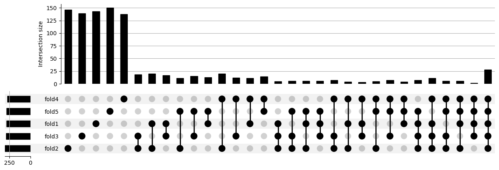

## 1. Description

Given the dataset's complexity and scale precluding us from doing traditional phylogenomic analyses, we decided to use Machine Learning (XGBoost) to identify putative interesting genes. In this part, we want to identify genes that may have been involved in the convergent transition to life on land due to their pattern of gain-loss-duplication-expansion. Here, we expect to get genes that were old but were independently co-opted or lost in terrestrial lineages (parallel evolution).

## 2. Workflow

### 0. Installation of required packages in Conda/Python environment

Let’s first define the packages that will be used in all the final analyses, including dRFE and hyperparameter optimization.

Create a new conda environment with the Python version used in all analyses (`v3.10.8`):

```bash
conda env create -f ml_dask_xgb.yml --name ml_dask_xgb
conda activate ml_dask_xgb
conda install seaborn
#Path to python and pip in Apollo (if not used, error)
#/home/metazomics/miniconda3/envs/ml_dask_xgb/bin/
```

[ml_dask_xgb.yml](ml_dask_xgb.yml)

This conda environment already includes all Python dependencies needed. Now, as an alternative, we could create a new Python environment with the same dependencies, as we have in CESGA:

- Python environment and packages
    
    ```bash
    #python/3.10.8
    python -m venv ml_venv
    source ml_venv/bin/activate
    #We'll install dRFEtools to avoid any problems with putative dependencies
    ```
    
    [ml_venv_requirements.txt](ml_venv_requirements.txt)

### 1. Activate Conda environment

```bash
conda activate ml_dask_xgb
#export LD_LIBRARY_PATH=~/miniconda3/lib #Apollo avoid error ImportError: /lib/x86_64-linux-gnu/libstdc++.so.6: version `GLIBCXX_3.4.29' not found (required by /home/metazomics/miniconda3/envs/ml_dask_xgb/lib/python3.10/site-packages/pandas/_libs/window/aggregations.cpython-310-x86_64-linux-gnu.so) when using python3.10
#/home/metazomics/miniconda3/envs/ml_dask_xgb/bin/pip install -r ml_venv_requirements.txt
```

### 2. Preprocessing of Species-OGs file

Before starting to load input data for our model, we need the file to have in the columns the features (OGs) and in the rows the species. The original file that contains this information has OGs as rows and species as columns (with 2 extra columns for OG number and total number per species). Thus, we need to transpose the data:

```python
from utils import transpose_file
path="/mnt/netapp2/Store_csbyegim/Metazoa_OGs/ortholog_groups/"
ogs_sp_file=path+"ortholog_counts_per_species.stats.tsv"
transpose_file(ogs_sp_file, "transposed_ortholog_counts_per_species.stats.tsv", "\t")
```

[utils.py](images/utils.py)

```bash
head -n-1 transposed_ortholog_counts_per_species.stats.tsv | tail -n+2 > temp.txt
mv temp.txt transposed_ortholog_counts_per_species.stats.tsv
```

From the full transposed matrix, we need to remove the outgroups, to add information on the Habitat and Phylum to facilitate the following steps.

```python
import dask.dataframe as dd
import dask.array as da
from dask.distributed import LocalCluster
import numpy as np
import pandas as pd

#Start dask client
cluster = LocalCluster() 
client = cluster.get_client()

path="/home/gemma/Desktop/Machine_Learning/"
ogs_sp_file=path+"transposed_ortholog_counts_per_species.stats.tsv"
sp_habitat_file=path+"species_habitat.txt" #Column 1: species code; column 2: habitat
conversion_file=path+"species_num_conversion.txt" #Column 1: species num; column 2: species file; column 3: species code
sp_phylum_file=path+"species_phylum_simplified.txt" #Column 1: phylum; column 2: species code

#Read ortholog_counts_per_species.stats.tsv
df = dd.read_csv(ogs_sp_file, sep='\t', header=None)
#REMEMBER: Group_ID (OGs) start in 1
df_species=df[[0,1]]

#Read conversion between species file in OG table and taxon list codes
sp_file_df = dd.read_csv(conversion_file, sep='\t', header=None) 
#Remove the first column (it just has number of species) and rename the columns to match the df)
sp_file_df = sp_file_df.drop(columns=[0]).rename(columns={1:0,2:'Code'})
#Add conversion information and remove file column
sp_df = df_species.merge(sp_file_df,on=[0]).drop(columns=1)

#Read habitat information per species. In this step, outgroups are removed
hab_df = dd.read_csv(sp_habitat_file, sep='\t', header=None).rename(columns={0:'Code',1:'Habitat'})
hab_df = hab_df.replace('Aquatic',0).replace('Terrestrial',1) #Change habitats to 0 and 1
hab_df['Habitat'] = hab_df['Habitat'].astype(int) #Save type to integer. Otherwise downstream functions fail
#Add habitat information
sp_hab_df = sp_df.merge(hab_df, on="Code")

#Read phylum information per species.
phyl_df = dd.read_csv(sp_phylum_file, sep='\t', header=None).rename(columns={1:'Code',0:'Phylum'})
#Add phylum information
sp_hab_phyl_df = sp_hab_df.merge(phyl_df, on="Code").compute()

#Add id to file
sp_hab_phyl_df['id']=range(len(hab_df))

#Save file with metadata into csv
sp_hab_phyl_df.to_csv("sp_habitat_phylum_id.tsv", sep="\t", header=False, index=False)
	
#Get list of not outgroup species
sp_hab_phyl_df[0].to_csv("no_outgroup_sp.txt", sep="\t", header=False, index=False)

#Save headers into file
#pd.DataFrame(["File"]+list(sp_hab_phyl_df.columns[1:]) + list(range(1,522935))).T.to_csv("headers.tsv", sep="\t", header=False, index=False)
pd.DataFrame(["File"]+list(sp_hab_phyl_df.columns[1:]) + list(range(1,514980))).T.to_csv("headers.tsv", sep="\t", header=False, index=False)
```

```bash
grep -f no_outgroup_sp.txt transposed_ortholog_counts_per_species.stats.tsv | cut -f2-> transposed_ortholog_counts_per_species_no_outgroups.stats.tsv
```

```bash
paste sp_habitat_phylum_id.tsv transposed_ortholog_counts_per_species_no_outgroups.stats.tsv > transposed_Species_OGs_habitat_phylum_no_header.tsv
```

```bash
cat headers.tsv transposed_Species_OGs_habitat_phylum_no_header.tsv > transposed_Species_OGs_habitat_phylum.tsv
```

### 3. Filtering OGs for Machine Learning (Gene family)

To decrease the execution time of the ML training using the full dataset, I will remove some OGs that will not give me any information for the biological questions we have. Most information on feature elimination first recommends to filter based on previous knowledge.

These are the OGs that are **not informative**:

- **Species-specific OGs**: these won’t tell me anything about the shared gene families involved in terrestrialization. In the case of only having one species of a terrestrial lineage (e.g. the amphipod), we won’t be able to distinguish between the species-specific gene families and the exclusive of the terrestrial lineage ones.
    
    In addition, after removing outgroups from the table when adding habitat information, there may be OGs left with only 0s as values (**only found on outgroups**). We can remove these at the same time as species-specific OGs using the following code:
    
    ```python
    #Get boolean on whether the sum of the columns is 0 or 1 (True). We need to remove id and Habitat as they are numeric
    # mask=df.sum(axis=0, numeric_only=True).drop(['id','Habitat'].isin([0,1]) #With this code we are only removing single-copy species-specific genes
    mask=df.sum(axis=0, numeric_only=True).drop(['id','Habitat'].isin([0,1])
    #Get original list of OGs to filter
    OGs_to_filter=mask.index
    #Subset the original data based on this boolean. ~ means negation of the mask (i.e. we don't want the values that are 0 or 1)
    OGs_to_keep=list(OGs_to_filter[~mask]
    df_filtered=df[['id','Code','Phylum','Habitat']+OGs_to_keep]
    ```
    
- **OGs exclusive of aquatic-only phyla**: Some phyla are formed by only aquatic species (e.g. Porifera). OGs that are only found on those phyla won’t tell us anything about terrestrialization. I will go back on the tree for those clades where all descendants are fully aquatic phyla.
        
    - Script to get the list of OGs to remove (42,567 OGs)
        
        ```python
        import pickle
        from ete3 import PhyloTree
        
        #Load species tree
        species_tree="metazoa_sp_tree_node_names.nwk"
        t=PhyloTree(species_tree, format=8)
        
        #Load OG-age info
        with open("age_OG.pickle","rb") as f:
        	age_OG=pickle.load(f)
        
        #List of nodes of each fully aquatic phyla (excluding phyla with only one species that should have been filtered before) and their descendants
        #Porifera
        porifera=[t.get_common_ancestor(["SCIL1","AQUE1"])]+t.get_common_ancestor(["SCIL1","AQUE1"]).get_descendants()
        #Placozoa
        placozoa=[t.get_common_ancestor(["HHON1","TRIC1"])]+t.get_common_ancestor(["HHON1","TRIC1"]).get_descendants()
        #Cnidaria
        cnidaria=[t.get_common_ancestor(["DCRI1","MVIR1"])]+t.get_common_ancestor(["DCRI1","MVIR1"]).get_descendants()
        #Xenoturbellida + Acoela + Nemertodermatida
        xenacoelomorpha=[t.get_common_ancestor(["XBOC1","CNAI1"])]+t.get_common_ancestor(["XBOC1","CNAI1"]).get_descendants()
        #Echinodermata + Hemichordata
        echinodermata_hemichordata=[t.get_common_ancestor(["CHEH1","SKOW1"])]+t.get_common_ancestor(["CHEH1","SKOW1"]).get_descendants()
        #Cephalochordata
        cephalochordata=[t.get_common_ancestor(["BBEL1","BFLO1"])]+t.get_common_ancestor(["BBEL1","BFLO1"]).get_descendants()
        #Urochordata
        urochordata=[t.get_common_ancestor(["ODIO1","CINT1"])]+t.get_common_ancestor(["ODIO1","CINT1"]).get_descendants()
        #Kinorrhyncha + Priapulida
        kinorrhyncha_priapulida=[t.get_common_ancestor(["PCAU1","TSEM1"])]+t.get_common_ancestor(["PCAU1","TSEM1"]).get_descendants()
        #Nematomorpha
        nematomorpha=[t.get_common_ancestor(["NMUN2","GOKK1"])]+t.get_common_ancestor(["NMUN2","GOKK1"]).get_descendants()
        #Chaetognatha + Rotifera
        chaetognatha_rotifera=[t.get_common_ancestor(["BPLI1","PAEL1"])]+t.get_common_ancestor(["BPLI1","PAEL1"]).get_descendants()
        #Dicyemida
        dicyemida=[t.get_common_ancestor(["DICY1","DIKM1"])]+t.get_common_ancestor(["DICY1","DIKM1"]).get_descendants()
        #Gastrotricha
        gastrotricha=[t.get_common_ancestor(["DASP1","MLAT1"])]+t.get_common_ancestor(["DASP1","MLAT1"]).get_descendants()
        #Bryozoa + Entoprocta + Cycliophora
        bryozoa_entoprocta_cycliophora=[t.get_common_ancestor(["SPAN1","DFRU1"])]+t.get_common_ancestor(["SPAN1","DFRU1"]).get_descendants()
        #Brachiopoda + Phoronida
        brachiopoda_phoronida=[t.get_common_ancestor(["PAUS1","MVEN1"])]+t.get_common_ancestor(["PAUS1","MVEN1"]).get_descendants()
        
        nodes_to_check=porifera+placozoa+cnidaria+xenacoelomorpha+echinodermata_hemichordata+cephalochordata+urochordata+kinorrhyncha_priapulida+nematomorpha+chaetognatha_rotifera+dicyemida+gastrotricha+bryozoa_entoprocta_cycliophora+brachiopoda_phoronida
        
        #Get list of OGs to remove
        OGs_to_remove=[]
        for node in nodes_to_check:
        	#Test if error. If so: remove .get_leaves() from lists. Or,
        	if node in t.get_leaves() or node.name not in age_OG:
        		continue
        	OGs_to_remove=OGs_to_remove+age_OG[node.name]
        	
        #Save info to file
        with open("OGs_exclusive_fully_aquatic_phyla.txt", "wt") as f:
        	for OG in OGs_to_remove:
        		f.write(str(OG)+"\n")
        ```
        
    
    From the obtained list (saved in a file in CESGA) we can do the filtering step.
    
    ```python
    "OGs_exclusive_fully_aquatic_phyla.txt"
    ```
    
Some other categories **might be informative**, so it’s better to leave them:

- **OGs only found in aquatic species**: Some OGs might have been lost in terrestrial species. In addition, there are some aquatic species nested within terrestrial phyla (e.g. Xiphosura).
- **OGs only found in terrestrial lineages**: One problem here is that we are not sure about the timing of the terrestrialization events. We would need to go node by node to see which OGs we need to remove, and this depends on when we estimate that the terrestrialization happened.
- **OGs exclusive of a non-only aquatic phylum**: For phyla that have aquatic and terrestrial species, these OGs might be informative or not in the model (if we will get only common to all events or also about some events inside phyla). For example, arthropods that have several terrestrialization events, and maybe the model can help us identify OGs that originated in arthropods but that were lost/duplicated/whatever later on independently. Also, and maybe more importantly, we are working on gene counts not presence/absence. So, it could be that the gene is present in all species in the phylum but has more copies in the terrestrial ones.

```python
import dask.dataframe as dd
import dask.array as da
from dask.distributed import LocalCluster
import numpy as np
import pandas as pd

#Start dask client
cluster = LocalCluster() 
client = cluster.get_client()

path="/home/gemma/Desktop/Machine_Learning/"
transposed_preprocessed_full_OGs_file=path+"transposed_Species_OGs_habitat_phylum.tsv"
OGs_exclusively_aquatic_file=path+"OGs_exclusive_fully_aquatic_phyla.txt"

#Read transposed_Species_OGs_habitat_phylum.tsv
df = dd.read_csv(transposed_preprocessed_full_OGs_file, sep='\t', sample=5000000)

#Convert to species pesence/absence binary table
df_presence_absence = df.drop(columns=['File', 'Code', 'id', 'Habitat', 'Phylum'])

# Now, use map_partitions to apply the transformation using pandas' applymap
df_presence_absence = df_presence_absence.map_partitions(lambda pdf: pdf.applymap(lambda x: 1 if x >= 1 else 0))

#Remove species-specific OGs
#Get boolean on whether the sum of the columns is 0 or 1 (True). We need to remove id and Habitat beccause it raises an error otherwise (even though they are numeric and it won't affect): AttributeError: 'Sum' object has no attribute 'drop'
mask=df_presence_absence.sum(axis=0, numeric_only=True).isin([0,1])
#Get original list of OGs to filter
OGs_to_filter=mask.index
#Subset the original data based on this boolean. ~ means negation of the mask (i.e. we don't want the values that are 0 or 1)
OGs_no_sp_specific=pd.DataFrame(OGs_to_filter[~mask])
#Convert to string to check values later
OGs_no_sp_specific[0] = OGs_no_sp_specific[0].astype(str)

#Remove OGs exclusive of fully aquatic phyla
#Get list of OGs
OGs_aquatic_phyla=pd.read_csv(OGs_exclusively_aquatic_file,header=None)
OGs_aquatic_phyla=list(OGs_aquatic_phyla.astype(str)[0])
#Remove those OGs from list of OGs not species specific
OGs_to_keep=OGs_no_sp_specific[~OGs_no_sp_specific[0].isin(OGs_aquatic_phyla)]

#Filter dataframe
df_filtered=df[['File','id','Code','Phylum','Habitat']+list(OGs_to_keep[0])]

#Save to files
df_filtered.to_csv("filtered_transposed_Species_OGs_habitat_phylum.tsv", sep="\t", header=True, index=False)
```

The output of this is a directory called "filtered_transposed_Species_OGs_habitat_phylum.tsv" with 15 files (one file per partition).

| Data | # OGs (new) |
| --- | --- |
| Original dataset | 514,979 |
| Filtered by species-specific | 486,024 |
| Filtered by species-specific + OGs exclusive fully aquatic | 443,457 |

### 4. Training the model (post-filtered full dataset)

Once we have filtered the new dataset, we can train the model to see how many features are used across all folds to decide how to proceed.

However, we will first need the ids for the stratification. As it takes that long to load the dataset and so on, the best option is to do it before with a subset.

- Get ids for stratification using a very small subset from the original data
    
    First, let’s create the subset file form the original ones. We only care about the first 5 columns with metadata and we’ll add some extra to ensure that the code works. 
    
    ```bash
    cd /mnt/netapp2/Store_csbyegim/Metazoa_OGs/ML_Species-OGs/full_dataset
    
    #Set variables for original and filtered dataset (divided in 15 partitions)
    ORIG_DATA_PART=filtered_transposed_Species_OGs_habitat_phylum.tsv
    NEW_DATA_PART=data_for_getting_stratification_indexes.tsv
    
    #Create empty new file with headers
    cut -f1-10 $ORIG_DATA_PART/00.part | head -n1 > $NEW_DATA_PART
    
    #Subset OGs from the original dataset (get first 5 columns with metadata and then the first 5 OGs from the model)
    for FILE in $(ls $ORIG_DATA_PART)
    do
    	cut -f1-10 $ORIG_DATA_PART/$FILE | tail -n+2 >> $NEW_DATA_PART
    done
    ```
    
    Then, let’s execute the code for getting these new indexes
    
    ```python
    import dask.dataframe as dd
    import dask.array as da
    from os.path import join, exists
    from sklearn.model_selection import StratifiedKFold
    
    from dask.distributed import LocalCluster
    
    import xgboost,dask_ml,sklearn,time,random,pickle
    from xgboost import dask as dxgb
    from xgboost.dask import DaskDMatrix
    from dask_ml.metrics import mean_squared_error,accuracy_score
    from sklearn.metrics import balanced_accuracy_score,confusion_matrix,roc_curve,auc
    
    import matplotlib.pyplot as plt
    from matplotlib.patches import Patch
    import numpy as np
    import pandas as pd
    
    from statistics import mean
    from itertools import chain
    
    from dRFEtools_xgboost_plus_orig_feat_sel import *
    
    #Function to get Dask divisions for datasets
    def get_divisions(a, n):
    	"""
    	Obtain divisions for Dask dataframe.
    
    	Args:
       		a: list of values to use
       		n: number of partitions
    
    	Returns:
    		tuple: Divisions for Dask dataframe
    	"""
    	k, m = divmod(len(a), n)
    	x=list(a[i*k+min(i, m):(i+1)*k+min(i+1, m)] for i in range(n))
    	list_x=[x[i][-1] for i in range(n)]
    	list_x.append(a[0])
    	return tuple(sorted(list_x))
    
    #Start dask client
    cluster = LocalCluster() 
    client = cluster.get_client()
    
    RANDOM_STATE = 42 #To ensure reproducibility
    random.seed(RANDOM_STATE)
    
    stratif_subset_file="data_for_getting_stratification_indexes.tsv"
    
    #Read Species-GO file (with species name)
    df = dd.read_csv(stratif_subset_file, sep='\t', sample=500000)
    
    #Select columns corresponding to OGs and ID for index (all but 'Code', 'Habitat', 'Phylum' and 'File')
    X = df.drop(columns=['Code','Habitat','Phylum','File'])
    #Select column to predict ('Habitat'), the extra column for stratification ('Phylum'), and ID for index.
    y = df[['id','Habitat','Phylum']]
    
    #Set index for X and y
    X=X.set_index('id')
    y=y.set_index('id')
    
    #Do the Stratified Kfold
    skf = StratifiedKFold(n_splits=5, shuffle=True, random_state=RANDOM_STATE)
    
    #Get train and test indexed for each fold (we use X.columns[0] instead of the whole X as we don't need it to get indexes. Using the whole data will be very slow
    y['strat_label'] = y['Habitat'].astype(str) + "_" + y['Phylum'].astype(str)
    idx_skf = [[idx_train,idx_test] for idx_train,idx_test in skf.split(X[X.columns[0]],y['strat_label'])]
    #UserWarning: The least populated class in y has only 2 members, which is less than n_splits=5.
    
    # Obtain a dictionary for mapping the id to the Species name
    mapping_dict=pd.Series(list(df[['Code']].compute()['Code']), index=list(df[['id']].compute()['id'])).to_dict()
    
    # Replace the numbers in the copy (idx_skf_sp) using the mapping
    idx_skf_sp = []
    for fold in idx_skf:
        fold_sp = []  # This will hold the replaced arrays for each fold
        for arr in fold:
            # Replace numbers with strings using the mapping
            fold_sp.append(np.array([mapping_dict[num] for num in arr]))
        idx_skf_sp.append(fold_sp)  # Append the replaced fold to idx_skf_sp
        
    # Save stratification for using in the ML Species-OGs full dataset (for some reason, it keeps failing when doing the stratification).
    with open("idx_skf_sp.pickle","wb") as f:
    	pickle.dump(idx_skf_sp,f,pickle.HIGHEST_PROTOCOL)
    ```
    

Now, we can start training the model

```python
import dask.dataframe as dd
import dask.array as da
from os.path import join, exists
from sklearn.model_selection import StratifiedKFold

from dask.distributed import LocalCluster

import xgboost,dask_ml,sklearn,time,random,pickle
from xgboost import dask as dxgb
from xgboost.dask import DaskDMatrix
from dask_ml.metrics import mean_squared_error,accuracy_score
from sklearn.metrics import balanced_accuracy_score,confusion_matrix

import matplotlib.pyplot as plt
from matplotlib.patches import Patch
import numpy as np
import pandas as pd

from statistics import mean
from itertools import chain

from dRFEtools_xgboost_plus_orig_feat_sel import *
```

```python
import dask
dask.config.set({"distributed.scheduler.worker-saturation":  1.1})

#Start dask client
cluster = LocalCluster(n_workers=10,
                       memory_limit='100GB') 
client = cluster.get_client()
```

It took almost 24 days for the full model (1 iteration, 5 folds) in CESGA with the old OGs.

```python
RANDOM_STATE = 42 #To ensure reproducibility
random.seed(RANDOM_STATE)
ogs_sp_file="/mnt/netapp2/Store_csbyegim/Metazoa_OGs/ML_Species-OGs/full_dataset/filtered_transposed_Species_OGs_habitat_phylum.tsv"

#Read file
df = dd.read_csv(ogs_sp_file+"/*", sep='\t', sample=5000000, blocksize=None)
#REMEMBER: Group_ID (OGs) start in 1

#Select columns corresponding to OGs and ID for index (all but 'Code', 'Habitat', 'Phylum' and 'File')
X = df.drop(columns=['Code','Habitat','Phylum','File'])
#Select column to predict ('Habitat'), the extra column for stratification ('Phylum'), and ID for index.
y = df[['id','Habitat','Phylum']]

#Set index for X and y
X=X.set_index('id')
y=y.set_index('id')

#Get stratification indexes from subset of the data (see above). When using traditional StratifiedKFold function (which comes from sklearn) there is some problem with shuffle and the dask dataframes. See Debugging page
with open("idx_skf_sp.pickle","rb") as f:
	idx_skf_sp=pickle.load(f)

#Modify idx_skf to get new ids
codes_sp=list(list(df[['Code']].compute().values))
id_sp=list(list(df[['id']].compute().values))
mapping_dict=pd.Series([id_sp[i][0] for i in range(964)], index=[codes_sp[i][0] for i in range(964)]).to_dict()

# Replace the numbers in the copy (idx_skf_sp) using the mapping
idx_skf = []
for fold in idx_skf_sp:
    fold_sp = []  # This will hold the replaced arrays for each fold
    for arr in fold:
        # Replace numbers with strings using the mapping
        fold_sp.append(np.array([mapping_dict[num] for num in arr]))
    idx_skf.append(fold_sp)
```

**Check that stratification was correct**

- Code for stratification plot
    
    ```python
    df_stratkfold=y.compute()
    fold=1
    for tr,tt in idx_skf:
        indices = np.array([np.nan] * (len(tr)+len(tt)))
        indices[tt] = 1 #Testing
        indices[tr] = 0 #Training
        df_stratkfold["F"+str(fold)]=indices
        fold=fold+1
    
    df_stratkfold=df_stratkfold.sort_values('Habitat')
    df_stratkfold['Phylum'] = pd.Categorical(df_stratkfold['Phylum'], ["NO_BILATERIA","XENACOELOMORPHA","DEUTEROSTOMIA","CRANIATA","ECDYSOZOA","NEMATODA","TARDIGRADA","ONYCHOPHORA","ARTHROPODA","LOPHOTROCHOZOA","PLATYHELMINTHES","MOLLUSCA","ANNELIDA","NEMERTEA"])
    df_stratkfold=df_stratkfold.sort_values("Phylum")
    df_stratkfold=df_stratkfold.replace(["NO_BILATERIA","XENACOELOMORPHA","DEUTEROSTOMIA","CRANIATA","ECDYSOZOA","NEMATODA","TARDIGRADA","ONYCHOPHORA","ARTHROPODA","LOPHOTROCHOZOA","PLATYHELMINTHES","MOLLUSCA","ANNELIDA","NEMERTEA"], [0,1,2,3,4,5,6,7,8,9,10,11,12,13])
    
    # Assume df_stratkfold is your DataFrame, cmap_cv for train/test, and cmap_data for Habitat/Phylum.
    cmap_cv = plt.cm.coolwarm
    cmap_data = plt.cm.tab20
    # Manual color mapping for Habitat
    habitat_colors = {0: 'skyblue', 1: 'saddlebrown'}
    
    # Phylum names corresponding to their numerical codes
    phylum_names = ["NO_BILATERIA", "XENACOELOMORPHA", "DEUTEROSTOMIA", "CRANIATA", "ECDYSOZOA", 
                    "NEMATODA", "TARDIGRADA", "ONYCHOPHORA", "ARTHROPODA", "LOPHOTROCHOZOA", 
                    "PLATYHELMINTHES", "MOLLUSCA", "ANNELIDA", "NEMERTEA"]
    
    plt.figure()
    fig, ax = plt.subplots(figsize=(12, 8))
    
    # Scatter plot for train/test sets (df_stratkfold.columns[2:])
    for col in df_stratkfold.columns[2:]:
        ax.scatter(
            range(len(df_stratkfold[col])),
            np.repeat(int(col[-1]) + 1, len(df_stratkfold[col])),
            c=df_stratkfold[col],
            marker="_",
            lw=10,
            cmap=cmap_cv,
            vmin=-0.2,
            vmax=1.2,
        )
    
    # Scatter plot for Habitat
    for i, habitat_value in enumerate(df_stratkfold['Habitat']):
        ax.scatter(
            i, 1,  # Y position is 1 for Habitat
            color=habitat_colors[habitat_value],
            marker="_",
            lw=10
        )
    
    # Scatter plot for Phylum
    ax.scatter(
        range(len(df_stratkfold['Phylum'])),
        np.repeat(0, len(df_stratkfold['Phylum'])),
        c=df_stratkfold['Phylum'],
        marker="_",
        lw=10,
        cmap=cmap_data
    )
    
    # Formatting y-ticks and labels
    yticklabels = ["Phylum", "Habitat"] + list(df_stratkfold.columns[2:])
    ax.set(
        yticks=np.arange(len(df_stratkfold.columns)),
        yticklabels=yticklabels
    )
    ax.set_title("StratifiedKFold", fontsize=15)
    
    # 1. First legend for Training and Testing sets
    train_test_legend = ax.legend(
        [Patch(color=cmap_cv(0.8)), Patch(color=cmap_cv(0.02))],
        ["Testing set", "Training set"],
        loc="center left",
        bbox_to_anchor=(1.05, 0.8)
    )
    
    # 2. Second legend for Habitat (Assuming 0 is terrestrial and 1 is aquatic)
    habitat_legend = plt.legend(
        [Patch(color='skyblue'), Patch(color='saddlebrown')],
        ["Aquatic", "Terrestrial"],
        loc="center left",
        bbox_to_anchor=(1.05, 0.7)
    )
    
    # 3. Third legend for Phylum (Phylum names instead of numbers)
    phylum_patches = [Patch(color=cmap_data(i / 13.0)) for i in range(14)]
    phylum_legend = plt.legend(
        phylum_patches,
        phylum_names,  # Use the names of the Phylum instead of numbers
        loc="center left",
        bbox_to_anchor=(1.05, 0.4)
    )
    
    # Add the first and second legends manually back to the plot
    ax.add_artist(train_test_legend)
    ax.add_artist(habitat_legend)
    
    # Save the plot
    plt.savefig("StratifiedKFold_data.png", bbox_inches="tight")
    plt.close()
    ```
    


- Code for plotting habitat distribution
    
    ```python
    import matplotlib.pyplot as plt
    import seaborn as sns
    import pandas as pd
    
    # Number of folds
    n_folds = len(idx_skf)
    
    # Create subplots for visualizing Habitat distributions across folds
    fig, axes = plt.subplots(n_folds, 1, sharex='col', sharey='row', figsize=(12, 5 * n_folds))
    plt.subplots_adjust(hspace=0.7)  # Increase spacing between subplots
    
    for fold in range(n_folds):
        idx_train = idx_skf[fold][0]
        idx_test = idx_skf[fold][1]    
        # Get the training and testing data for this fold and convert to pandas DataFrame
        y_train = y.loc[list(idx_train)].compute()  # Convert Dask DataFrame to pandas DataFrame
        y_test = y.loc[list(idx_test)].compute()    # Convert Dask DataFrame to pandas DataFrame
        # Map Habitat values to 'Aquatic' and 'Terrestrial'
        y_train['Habitat'] = y_train['Habitat'].map({0: 'Marine', 1: 'NonMarine'})
        y_test['Habitat'] = y_test['Habitat'].map({0: 'Marine', 1: 'NonMarine'})
        # Compute proportions for Habitat in Train and Test sets
        habitat_train_prop = y_train['Habitat'].value_counts(normalize=True).reset_index()
        habitat_train_prop.columns = ['Habitat', 'Proportion']
        habitat_train_prop['Set'] = 'Train'   
        habitat_test_prop = y_test['Habitat'].value_counts(normalize=True).reset_index()
        habitat_test_prop.columns = ['Habitat', 'Proportion']
        habitat_test_prop['Set'] = 'Test' 
        # Concatenate Train and Test proportions for Habitat
        habitat_combined = pd.concat([habitat_train_prop, habitat_test_prop])
        # Plot Habitat proportions for Train and Test in the same subplot with custom colors
        sns.barplot(x='Habitat', y='Proportion', hue='Set', data=habitat_combined, palette='plasma', ax=axes[fold])
        axes[fold].set_title(f'Fold {fold + 1} Habitat Proportions (Train vs Test)')
        axes[fold].set_xlabel("Habitat")  # X-axis label
        axes[fold].set_ylabel("Proportion")  # Y-axis label
    
    plt.tight_layout()
    
    # Save the plot
    plt.savefig("Strat_Habitat_distribution.png", bbox_inches="tight")
    plt.close()
    ```
    


- Code for plotting Phylum distribution
    
    ```python
    import matplotlib.pyplot as plt
    import seaborn as sns
    import pandas as pd
    
    # Number of folds
    n_folds = len(idx_skf)
    
    # Create subplots for visualizing Phylum distributions across folds
    fig, axes = plt.subplots(n_folds, 1, sharex='col', sharey='row', figsize=(10, 5 * n_folds))
    plt.subplots_adjust(hspace=0.5)
    
    for fold in range(n_folds):
        idx_train = idx_skf[fold][0]
        idx_test = idx_skf[fold][1]    
        
        # Get the training and testing data for this fold and convert to pandas DataFrame
        y_train = y.loc[list(idx_train)].compute()  # Convert Dask DataFrame to pandas DataFrame
        y_test = y.loc[list(idx_test)].compute()    # Convert Dask DataFrame to pandas DataFrame
        
        # Compute proportions for Phylum in Train and Test sets
        phylum_train_prop = y_train['Phylum'].value_counts(normalize=True).reset_index()
        phylum_train_prop.columns = ['Phylum', 'Proportion']
        phylum_train_prop['Set'] = 'Train'
        
        phylum_test_prop = y_test['Phylum'].value_counts(normalize=True).reset_index()
        phylum_test_prop.columns = ['Phylum', 'Proportion']
        phylum_test_prop['Set'] = 'Test'
        
        # Concatenate Train and Test proportions for Phylum
        phylum_combined = pd.concat([phylum_train_prop, phylum_test_prop])
        
        # Plot Phylum proportions for Train and Test in the same subplot
        sns.barplot(x='Phylum', y='Proportion', hue='Set', data=phylum_combined, palette='plasma', ax=axes[fold])
        axes[fold].set_title(f'Fold {fold + 1} Phylum Proportions (Train vs Test)')
        
        # Rotate x-axis labels by 45 degrees
        axes[fold].tick_params(axis='x', rotation=45)
    
    plt.tight_layout()
    
    # Save the plot
    plt.savefig("Strat_Phylum_distribution.png", bbox_inches="tight")
    plt.close()
    ```
    


**First model execution**

```python
#Name of features. In this dataset, we are working with numbers
#features = ["%d" % x for x in range(1,X.shape[1]+1)] #["f%d" % x for x in range(X.shape[1])] #with f it adds an f to feature name
features = np.array(X.columns) #Faster than previous option (above)
out_dir="."

starting_time = time.time()
starting_hour = time.asctime(time.localtime())

#Let's execute manually the xgboost_rfe and _xgboost_fe functions with just one iteration to get intermediate data
d = {}
pfirst = None

#From _xgboost_fe, let's train the model for all folds
indices_feats = np.arange(X.shape[1])
nf = len(features)
p={}
fold=1
#For each fold
for idx_train, idx_test in idx_skf:
	print("\nFold {}".format(fold))
	#Get data subsets
	X_train, X_test, y_train, y_test = get_strat_train_test(X,y['Habitat'],idx_train,idx_test)
	p[fold] = xgboost_fe_step(client, X_train, y_train, X_test, y_test, nf, features, out_dir)
	#Save results (p) at each fold (progressive, just in case something happens).
	with open("p_folds_until_"+str(fold)+"_stats_feat_importance_full_model.pickle","wb") as f:
		pickle.dump(p,f,pickle.HIGHEST_PROTOCOL)
	fold = fold+1

elapsed_time = time.time() - starting_time
ending_hour = time.asctime(time.localtime())
print("End of model training.\nElapsed time:", elapsed_time)

starting_time = time.time()
starting_hour = time.asctime(time.localtime())

#Now, we need to combine the results and see how many features are 0
features = np.array(features)
#Get feature importance (gain)
feature_importances_stats_np=np.array([p[f]['feat_importance'] for f in p])
#Get train and test accuracy
Acc_t=np.array([p[f]['accuracy_score_train'] for f in p])
Acc_v=np.array([p[f]['accuracy_score'] for f in p])
#Compute the per-fold common term based on accuracies
epsilon=0.00001
G = (Acc_t + Acc_v)/(abs((Acc_t - Acc_v))+epsilon)
#Calculate ranking of features
features_importance_new_rank = feature_importances_stats_np.T@G
#Save results (features_importance_new_rank)
with open("ranked_feat_importance_full_model.pickle","wb") as f:
	pickle.dump(features_importance_new_rank,f,pickle.HIGHEST_PROTOCOL)
	
elapsed_time = time.time() - starting_time
ending_hour = time.asctime(time.localtime())
print("End of features ranking.\nElapsed time:", elapsed_time)

#Check features that are 0
sum(features_importance_new_rank==0)
#Features that are not 0
len(features_importance_new_rank)-sum(features_importance_new_rank==0)
```

**First feature selection.**

```python
#First, we'll remove all features that are 0

#Last part of selected = features_rank_fnc(features, p, nf, out_dir)
rank = np.argsort(features_importance_new_rank)[::-1] # reverse sort. Take into account that if number of features to keep is higher than the number of features that were used in all folds, it will still select features that have a value of 0.
#Get number of features that are not 0
n_features_to_keep=len(features_importance_new_rank)-sum(features_importance_new_rank==0)
eliminated = rank[n_features_to_keep:]
selected = rank[:n_features_to_keep]
if len(eliminated) == 0:
	rank_df = pd.DataFrame({
		'Geneid': features[rank],
		'Rank': 1
	})
else:
	rank_df = pd.DataFrame({
		'Geneid': features[eliminated],
		'Rank': np.arange(n_features_to_keep + 1,
						  n_features_to_keep + 1 + len(eliminated))
	})

output_file = join(out_dir, "rank_features.txt")
rank_df.sort_values('Rank', ascending=False).to_csv(
	output_file,
	sep='\t',
	mode='a',
	index=False,
	header=not exists(output_file)
)
#Once selected, let's get stats and subset data
a =[X_train.shape[1], [p[f]['logloss_train'] for f in p], [p[f]['logloss_test'] for f in p], [p[f]['accuracy_score'] for f in p], [p[f]['accuracy_score_train'] for f in p], elapsed_time, indices_feats]
indices_feats = indices_feats[selected]
features = np.array(features)[selected].tolist()
X = X.loc[:, features]
#from _xgboost_rfe
if pfirst is None:
	pfirst = a
```

Up to this part, it took 18 days to run.

- Code to plot how many features are common between folds and get stats
    
    ```python
    import numpy as np
    import pickle
    import matplotlib.pyplot as plt
    from upsetplot import UpSet,from_contents
    
    with open("p_folds_until_5_stats_feat_importance_full_model.pickle","rb") as f:
    	p=pickle.load(f)
    
    print("logloss_train")
    ['{0:.5g}'.format(p[f]['logloss_train']) for f in p]
    print("logloss_test")
    ['{0:.5g}'.format(p[f]['logloss_test']) for f in p]
    print("features importance != 0")
    [sum(p[f]['feat_importance'] == 0) for f in p]
    print("accuracy_score")
    ['{0:.5g}'.format(p[f]['accuracy_score']) for f in p]
    print("accuracy_score_train")
    ['{0:.5g}'.format(p[f]['accuracy_score_train']) for f in p]
    
    features_used = from_contents({
    	"fold1":[index for index, value in enumerate(p[1]['feat_importance']) if value != 0],
    	"fold2":[index for index, value in enumerate(p[2]['feat_importance']) if value != 0],
    	"fold3":[index for index, value in enumerate(p[3]['feat_importance']) if value != 0],
    	"fold4":[index for index, value in enumerate(p[4]['feat_importance']) if value != 0],
    	"fold5":[index for index, value in enumerate(p[5]['feat_importance']) if value != 0]
    })
    
    plt.figure()
    ax_dict = UpSet(features_used, subset_size="count").plot()
    plt.savefig("first_iteration_full_model_5kfolds_UpSet_features.png",bbox_inches="tight")
    plt.close()
    ```
    

Let’s check the stats for this first iteration (5 folds)

| Fold | logloss train | logloss test | # feats ≠0 | accuracy train | accuracy test |
| --- | --- | --- | --- | --- | --- |
| 1 | 0.0034241 | 0.15742 | 286 | 1 | 0.94167 |
| 2 | 0.0035456 | 0.094257 | 306 | 1 | 0.96759 |
| 3 | 0.0035274 | 0.10734 | 289 | 1 | 0.96566 |
| 4 | 0.0035026 | 0.15285 | 277 | 1 | 0.96154 |
| 5 | 0.0035136 | 0.18142 | 286 | 1 | 0.94986 |



**Create a new filtered input table for the ML model by removing OGs that have a feature importance of 0**

```bash
cd /mnt/netapp2/Store_csbyegim/Metazoa_OGs/ML_Species-OGs/full_dataset

#Get features that are 0 (removed in the first iteration)
tail -n+2 rank_features.txt | cut -f1 > features_eq0_first_it.txt

#Set variables for original and filtered dataset (divided in 15 partitions)
ORIG_DATA_PART=filtered_transposed_Species_OGs_habitat_phylum.tsv
NEW_DATA_PART=filtered_transposed_Species_OGs_habitat_phylum_after_first_it_ML

#Create new directory for the data
mkdir $NEW_DATA_PART

#Get OGs to keep
OGS_TO_KEEP=$(python get_OGs_not_0_importance.py)

#Subset OGs from the original dataset (get first 5 columns with metadata and then the OGs from the model)
for FILE in $(ls $ORIG_DATA_PART)
do
	cut -f1-5,"$OGS_TO_KEEP" $ORIG_DATA_PART/$FILE > $NEW_DATA_PART/$FILE
done
```

- get_OGs_not_0_importance.py
    
    ```python
    #!/usr/bin/env/python
    
    #Read headers of file
    with open("filtered_transposed_Species_OGs_habitat_phylum.tsv/00.part","rt") as f:
    	data_columns=set(f.readline().strip().split("\t"))
    
    #Read list of OGs to remove
    feats_to_remove=[]
    with open("features_eq0_first_it.txt","rt") as f:
    	line=f.readline().strip()
    	while line:
    		feats_to_remove.append(line)
    		line=f.readline().strip()
    
    #Get columns to keep
    columns_to_keep=data_columns-set(feats_to_remove)
    
    #Add 5 (columns not OGs) to the number of OGs to keep and
    OGs_final=[]
    for col in columns_to_keep:
    	if col.isnumeric():
    		OGs_final.append(str(int(col)+5))
    	else:
    		continue
    
    #Print final number of columns
    print(",".join(OGs_final))
    ```
    

**Continue dRFE with the new filtered dataset (plus checking that stratification is still correct)**

- Load modules and start cluster (with default resources)
    
    ```python
    import dask.dataframe as dd
    import dask.array as da
    from os.path import join, exists
    from sklearn.model_selection import StratifiedKFold
    
    from dask.distributed import LocalCluster
    
    import xgboost,dask_ml,sklearn,time,random,pickle
    from xgboost import dask as dxgb
    from xgboost.dask import DaskDMatrix
    from dask_ml.metrics import mean_squared_error,accuracy_score
    from sklearn.metrics import balanced_accuracy_score,confusion_matrix,roc_curve,auc
    
    import matplotlib.pyplot as plt
    from matplotlib.patches import Patch
    import numpy as np
    import pandas as pd
    
    from statistics import mean
    from itertools import chain
    
    from dRFEtools_xgboost_plus_orig_feat_sel import *
    ```
    
    ```python
    import dask
    dask.config.set({"distributed.scheduler.worker-saturation":  1.1})
    
    #Start dask client
    cluster = LocalCluster() 
    client = cluster.get_client()
    ```
    

```python
RANDOM_STATE = 42 #To ensure reproducibility
random.seed(RANDOM_STATE)
ogs_sp_file="/mnt/netapp2/Store_csbyegim/Metazoa_OGs/ML_Species-OGs/full_dataset/filtered_transposed_Species_OGs_habitat_phylum_after_first_it_ML"

#Read file
df = dd.read_csv(ogs_sp_file+"/*", sep='\t', blocksize=None)
#REMEMBER: Group_ID (OGs) start in 1

#Select columns corresponding to OGs and ID for index (all but 'Code', 'Habitat', 'Phylum' and 'File')
X = df.drop(columns=['Code','Habitat','Phylum','File'])
#Select column to predict ('Habitat'), the extra column for stratification ('Phylum'), and ID for index.
y = df[['id','Habitat','Phylum']]

#Set index for X and y
X=X.set_index('id')
y=y.set_index('id')

#Get stratification indexes from subset of the data (see above). When using traditional StratifiedKFold function (which comes from sklearn) there is some problem with shuffle and the dask dataframes. See Debugging page
with open("idx_skf_sp.pickle","rb") as f:
	idx_skf_sp=pickle.load(f)

#Modify idx_skf to get new ids
codes_sp=list(list(df[['Code']].compute().values))
id_sp=list(list(df[['id']].compute().values))
mapping_dict=pd.Series([id_sp[i][0] for i in range(964)], index=[codes_sp[i][0] for i in range(964)]).to_dict()

# Replace the numbers in the copy (idx_skf_sp) using the mapping
idx_skf = []
for fold in idx_skf_sp:
    fold_sp = []  # This will hold the replaced arrays for each fold
    for arr in fold:
        # Replace numbers with strings using the mapping
        fold_sp.append(np.array([mapping_dict[num] for num in arr]))
    idx_skf.append(fold_sp)
```

- Stratification check
    - Code for stratification plot
        
        ```python
        df_stratkfold=y.compute()
        fold=1
        for tr,tt in idx_skf:
            indices = np.array([np.nan] * (len(tr)+len(tt)))
            indices[tt] = 1 #Testing
            indices[tr] = 0 #Training
            df_stratkfold["F"+str(fold)]=indices
            fold=fold+1
        
        df_stratkfold=df_stratkfold.sort_values('Habitat')
        df_stratkfold['Phylum'] = pd.Categorical(df_stratkfold['Phylum'], ["NO_BILATERIA","XENACOELOMORPHA","DEUTEROSTOMIA","CRANIATA","ECDYSOZOA","NEMATODA","TARDIGRADA","ONYCHOPHORA","ARTHROPODA","LOPHOTROCHOZOA","PLATYHELMINTHES","MOLLUSCA","ANNELIDA","NEMERTEA"])
        df_stratkfold=df_stratkfold.sort_values("Phylum")
        df_stratkfold=df_stratkfold.replace(["NO_BILATERIA","XENACOELOMORPHA","DEUTEROSTOMIA","CRANIATA","ECDYSOZOA","NEMATODA","TARDIGRADA","ONYCHOPHORA","ARTHROPODA","LOPHOTROCHOZOA","PLATYHELMINTHES","MOLLUSCA","ANNELIDA","NEMERTEA"], [0,1,2,3,4,5,6,7,8,9,10,11,12,13])
        
        # Assume df_stratkfold is your DataFrame, cmap_cv for train/test, and cmap_data for Habitat/Phylum.
        cmap_cv = plt.cm.coolwarm
        cmap_data = plt.cm.tab20
        # Manual color mapping for Habitat
        habitat_colors = {0: 'skyblue', 1: 'saddlebrown'}
        
        # Phylum names corresponding to their numerical codes
        phylum_names = ["NO_BILATERIA", "XENACOELOMORPHA", "DEUTEROSTOMIA", "CRANIATA", "ECDYSOZOA", 
                        "NEMATODA", "TARDIGRADA", "ONYCHOPHORA", "ARTHROPODA", "LOPHOTROCHOZOA", 
                        "PLATYHELMINTHES", "MOLLUSCA", "ANNELIDA", "NEMERTEA"]
        
        plt.figure()
        fig, ax = plt.subplots(figsize=(12, 8))
        
        # Scatter plot for train/test sets (df_stratkfold.columns[2:])
        for col in df_stratkfold.columns[2:]:
            ax.scatter(
                range(len(df_stratkfold[col])),
                np.repeat(int(col[-1]) + 1, len(df_stratkfold[col])),
                c=df_stratkfold[col],
                marker="_",
                lw=10,
                cmap=cmap_cv,
                vmin=-0.2,
                vmax=1.2,
            )
        
        # Scatter plot for Habitat
        for i, habitat_value in enumerate(df_stratkfold['Habitat']):
            ax.scatter(
                i, 1,  # Y position is 1 for Habitat
                color=habitat_colors[habitat_value],
                marker="_",
                lw=10
            )
        
        # Scatter plot for Phylum
        ax.scatter(
            range(len(df_stratkfold['Phylum'])),
            np.repeat(0, len(df_stratkfold['Phylum'])),
            c=df_stratkfold['Phylum'],
            marker="_",
            lw=10,
            cmap=cmap_data
        )
        
        # Formatting y-ticks and labels
        yticklabels = ["Phylum", "Habitat"] + list(df_stratkfold.columns[2:])
        ax.set(
            yticks=np.arange(len(df_stratkfold.columns)),
            yticklabels=yticklabels
        )
        ax.set_title("StratifiedKFold", fontsize=15)
        
        # 1. First legend for Training and Testing sets
        train_test_legend = ax.legend(
            [Patch(color=cmap_cv(0.8)), Patch(color=cmap_cv(0.02))],
            ["Testing set", "Training set"],
            loc="center left",
            bbox_to_anchor=(1.05, 0.8)
        )
        
        # 2. Second legend for Habitat (Assuming 0 is terrestrial and 1 is aquatic)
        habitat_legend = plt.legend(
            [Patch(color='skyblue'), Patch(color='saddlebrown')],
            ["Aquatic", "Terrestrial"],
            loc="center left",
            bbox_to_anchor=(1.05, 0.7)
        )
        
        # 3. Third legend for Phylum (Phylum names instead of numbers)
        phylum_patches = [Patch(color=cmap_data(i / 13.0)) for i in range(14)]
        phylum_legend = plt.legend(
            phylum_patches,
            phylum_names,  # Use the names of the Phylum instead of numbers
            loc="center left",
            bbox_to_anchor=(1.05, 0.4)
        )
        
        # Add the first and second legends manually back to the plot
        ax.add_artist(train_test_legend)
        ax.add_artist(habitat_legend)
        
        # Save the plot
        plt.savefig("StratifiedKFold_data_check_after_filtering_feat_importance.png", bbox_inches="tight")
        plt.close()
        ```
        
    
    Important! This plot might not look like the one in previous runs. This is because when we calculate `df_stratkfold`, the order is not the same for some reason (related to the `compute` and how Dask internally manages the information). When we order `df_stratkfold` (which contains information on the fold each species is, i.e. the stratification) it is identical in both the subset and the full dataset. The same is true for `y` (which is the object from which `df_stratfold` is obtained (`df_stratkfold=y.compute()`). It is identical in the subset and the full dataset (test made in Hera with old dataset).
    
    
    
    - Code for plotting habitat distribution
        
        ```python
        import matplotlib.pyplot as plt
        import seaborn as sns
        import pandas as pd
        
        # Number of folds
        n_folds = len(idx_skf)
        
        # Create subplots for visualizing Habitat distributions across folds
        fig, axes = plt.subplots(n_folds, 1, sharex='col', sharey='row', figsize=(12, 5 * n_folds))
        plt.subplots_adjust(hspace=0.7)  # Increase spacing between subplots
        
        for fold in range(n_folds):
            idx_train = idx_skf[fold][0]
            idx_test = idx_skf[fold][1]    
            # Get the training and testing data for this fold and convert to pandas DataFrame
            y_train = y.loc[list(idx_train)].compute()  # Convert Dask DataFrame to pandas DataFrame
            y_test = y.loc[list(idx_test)].compute()    # Convert Dask DataFrame to pandas DataFrame
            # Map Habitat values to 'Aquatic' and 'Terrestrial'
            y_train['Habitat'] = y_train['Habitat'].map({0: 'Marine', 1: 'NonMarine'})
            y_test['Habitat'] = y_test['Habitat'].map({0: 'Marine', 1: 'NonMarine'})
            # Compute proportions for Habitat in Train and Test sets
            habitat_train_prop = y_train['Habitat'].value_counts(normalize=True).reset_index()
            habitat_train_prop.columns = ['Habitat', 'Proportion']
            habitat_train_prop['Set'] = 'Train'   
            habitat_test_prop = y_test['Habitat'].value_counts(normalize=True).reset_index()
            habitat_test_prop.columns = ['Habitat', 'Proportion']
            habitat_test_prop['Set'] = 'Test' 
            # Concatenate Train and Test proportions for Habitat
            habitat_combined = pd.concat([habitat_train_prop, habitat_test_prop])
            # Plot Habitat proportions for Train and Test in the same subplot with custom colors
            sns.barplot(x='Habitat', y='Proportion', hue='Set', data=habitat_combined, palette='plasma', ax=axes[fold])
            axes[fold].set_title(f'Fold {fold + 1} Habitat Proportions (Train vs Test)')
            axes[fold].set_xlabel("Habitat")  # X-axis label
            axes[fold].set_ylabel("Proportion")  # Y-axis label
        
        plt.tight_layout()
        
        # Save the plot
        plt.savefig("Strat_Habitat_distribution_check_after_filtering_feat_importance.png", bbox_inches="tight")
        plt.close()
        ```
        
    
    
    
    - Code for plotting Phylum distribution
        
        ```python
        import matplotlib.pyplot as plt
        import seaborn as sns
        import pandas as pd
        
        # Number of folds
        n_folds = len(idx_skf)
        
        # Create subplots for visualizing Phylum distributions across folds
        fig, axes = plt.subplots(n_folds, 1, sharex='col', sharey='row', figsize=(10, 5 * n_folds))
        plt.subplots_adjust(hspace=0.5)
        
        for fold in range(n_folds):
            idx_train = idx_skf[fold][0]
            idx_test = idx_skf[fold][1]    
            
            # Get the training and testing data for this fold and convert to pandas DataFrame
            y_train = y.loc[list(idx_train)].compute()  # Convert Dask DataFrame to pandas DataFrame
            y_test = y.loc[list(idx_test)].compute()    # Convert Dask DataFrame to pandas DataFrame
            
            # Compute proportions for Phylum in Train and Test sets
            phylum_train_prop = y_train['Phylum'].value_counts(normalize=True).reset_index()
            phylum_train_prop.columns = ['Phylum', 'Proportion']
            phylum_train_prop['Set'] = 'Train'
            
            phylum_test_prop = y_test['Phylum'].value_counts(normalize=True).reset_index()
            phylum_test_prop.columns = ['Phylum', 'Proportion']
            phylum_test_prop['Set'] = 'Test'
            
            # Concatenate Train and Test proportions for Phylum
            phylum_combined = pd.concat([phylum_train_prop, phylum_test_prop])
            
            # Plot Phylum proportions for Train and Test in the same subplot
            sns.barplot(x='Phylum', y='Proportion', hue='Set', data=phylum_combined, palette='plasma', ax=axes[fold])
            axes[fold].set_title(f'Fold {fold + 1} Phylum Proportions (Train vs Test)')
            
            # Rotate x-axis labels by 45 degrees
            axes[fold].tick_params(axis='x', rotation=45)
        
        plt.tight_layout()
        
        # Save the plot
        plt.savefig("Strat_Phylum_distribution_check_after_filtering_feat_importance.png", bbox_inches="tight")
        plt.close()
        ```
        
    
    
    

```python
features = np.array(X.columns)
out_dir="."

#Train rest of the model
starting_time = time.time()
starting_hour = time.asctime(time.localtime())

d, pfirst = xgboost_rfe(client, X, y['Habitat'], idx_skf, features, out_dir='.', elimination_rate=0.2)

elapsed_time = time.time() - starting_time
ending_hour = time.asctime(time.localtime())
print("End of model training.\nElapsed time:", elapsed_time)

#Get stats from previous run
with open("p_folds_until_5_stats_feat_importance_full_model.pickle","rb") as f:
	p=pickle.load(f)

original_num_ogs=len(p[1]['feat_importance'])
indices_feats = np.arange(original_num_ogs)
elapsed_time=23*24*60*60 #~ 23 days in seconds
a =[original_num_ogs, [p[f]['logloss_train'] for f in p], [p[f]['logloss_test'] for f in p], [p[f]['accuracy_score'] for f in p], [p[f]['accuracy_score_train'] for f in p], elapsed_time, indices_feats]

d[a[0]] = a
d = dict(sorted(d.items(),reverse=True))

with open("d_stats_feat_importance_full_model.pickle","wb") as f:
	pickle.dump(d,f,pickle.HIGHEST_PROTOCOL)
```

Once trained, let’s get the plots

- Functions to plot output values across all iterations
    
    ```python
    num_iterations = len(d)
    num_feats_iterations = [d[p][0] for p in d]
    logloss_train = [d[p][1] for p in d]
    logloss_test = [d[p][2] for p in d]
    accuracy_test = [d[p][3] for p in d]
    accuracy_train = [d[p][4] for p in d]
    time_elapsed = [d[p][5] for p in d][1:] #First iteration removed
    ```
    
    ```python
    plt.figure()
    fig, ax = plt.subplots(figsize=(12, 8))
    plt.plot(np.array(time_elapsed)/60, num_feats_iterations[1:], 'o-', color="tab:cyan", lw=3)
    ax.set(
        title="Summary of dRFE",
        xlabel="Time elapsed (mins)",
        ylabel="Number of features",
    )
    ax.legend();
    plt.savefig("summary_dRFE.png",bbox_inches="tight")
    plt.close()
    ```
    
    ```python
    plt.figure()
    fig, ax = plt.subplots(figsize=(12, 8))
    
    colors=["gold","orangered","deeppink","darkorchid","royalblue"]
    
    for f in range(len(logloss_train[0])):
    	logloss_train_fold=[i[f] for i in logloss_train]
    	logloss_test_fold=[i[f] for i in logloss_test]
    	plt.plot(np.log10(num_feats_iterations), logloss_train_fold,'o-', color=colors[f], lw=3, linestyle='dashed',
                 label='Training dataset fold '+str(f+1))
    	plt.plot(np.log10(num_feats_iterations), logloss_test_fold,'o-', color=colors[f], lw=3,
                 label='Test dataset fold '+str(f+1))
    
             
    ax.set(
        title="Logloss",
        xlabel="log10(Number of features used)",
        ylabel="Logloss",
    )
    ax.legend();
    plt.savefig("logloss_dRFE.png",bbox_inches="tight")
    plt.close()
    ```
    
    ```python
    plt.figure()
    fig, ax = plt.subplots(figsize=(12, 8))
    
    colors=["gold","orangered","deeppink","darkorchid","royalblue"]
    
    for f in range(len(accuracy_train[0])):
    	accuracy_train_fold=[i[f] for i in accuracy_train]
    	accuracy_test_fold=[i[f] for i in accuracy_test]
    	plt.plot(np.log10(num_feats_iterations) , accuracy_train_fold, 'o-', color=colors[f], lw=3, linestyle='dashed',
                 label='Training dataset fold '+str(f+1))
    	plt.plot(np.log10(num_feats_iterations) , accuracy_test_fold, 'o-', color=colors[f], lw=3,
                 label='Test dataset fold '+str(f+1))
    
            
    ax.set(
        title="Balanced accuracy",
        xlabel="log10(Number of features used)",
        ylabel="Balanced accuracy",
    )
    ax.legend();
    plt.savefig("balanced_accuracy_dRFE.png",bbox_inches="tight")
    plt.close()
    ```
    


To select the top genes, let’s use a function this time:

```python
# Compute the mean for each iteration
mean_logloss_train = np.array([np.mean(fold) for fold in logloss_train])
mean_logloss_test = np.array([np.mean(fold) for fold in logloss_test])
mean_accuracy_train = np.array([np.mean(fold) for fold in accuracy_train])
mean_accuracy_test = np.array([np.mean(fold) for fold in accuracy_test])

# Normalize values between 0 and 1
def normalize(array):
    return (array - np.min(array)) / (np.max(array) - np.min(array))

norm_logloss_train = 1 - normalize(mean_logloss_train)  # Invert because lower is better
norm_logloss_test = 1 - normalize(mean_logloss_test)    # Invert because lower is better
norm_accuracy_train = normalize(mean_accuracy_train)    # Higher is better
norm_accuracy_test = normalize(mean_accuracy_test)      # Higher is better

# Compute the overall score
combined_score = norm_logloss_train + norm_logloss_test + norm_accuracy_train + norm_accuracy_test

# Find the best index
best_index = np.argmax(combined_score)

# Print the result
print(f"Best overall index: {best_index}")
print(f"Best overall index corresponds to: {num_feats_iterations[best_index]} top OGs in the model")
```

The index selected is 10, corresponding to 130 features/OGs used.

### 5. Analyses with top OGs obtained with model

Once the model has finished 🎉, we need to extract first the top OGs based on the results of Logloss and accuracy. It will be 130 OGs.

```bash
cd /mnt/netapp2/Store_csbyegim/Metazoa_OGs/ML_Species-OGs/full_dataset
tail -n130 rank_features.txt | cut -f1 > top130_OGs.txt
```

Let’s check now the age of origin of those OGs.

- Python code to obtain the age of OGs
    
    ```python
    #!/usr/bin/venv/python
    
    from ete3 import PhyloTree
    import pickle
    import pandas as pd
    
    #Load species tree
    species_tree="/mnt/netapp2/Store_csbyegim/Metazoa_OGs/metazoa_sp_tree_node_names.nwk"
    t=PhyloTree(species_tree, format=1)
    
    def parse_sp_name(node_name):
        return node_name
    
    t.set_species_naming_function(parse_sp_name)
    
    #Load information on OG age
    og_age_file="/mnt/netapp2/Store_csbyegim/Metazoa_OGs/OG_age.pickle"
    with open(og_age_file,"rb") as f:
    	OG_age=pickle.load(f)
    
    #Load lists of genes for which you want to see age of origin
    ogs_top130_file="/mnt/netapp2/Store_csbyegim/Metazoa_OGs/ML_Species-OGs/full_dataset/top130_OGs.txt"
    ogs_top130=pd.read_csv(ogs_top130_file, sep="\t", header=None)
    
    #Add age to tree
    for OG in ogs_top130[0]:
    		node=t.search_nodes(name=OG_age[OG])[0]
    		try:
    			node.OG_num=node.OG_num+1 #Add number of genes that are in each node
    		except AttributeError:
    			node.add_feature("OG_num",1)
    
    #Save tree
    outtree="/mnt/netapp2/Store_csbyegim/Metazoa_OGs/ML_Species-OGs/full_dataset/metazoa_age_ogs_top130_ML.nwk"
    t.write(format=1,outfile=outtree, features=["OG_num"])
    ```
    


As expected, we only get OGs originating in the MRCA of independent terrestrialized clades. Most OGs originated at the root (61), not saved on the Newick (and even when including it manually in the file, it is not plotted by iTOL).

```bash
grep -wf top130_OGs.txt ../../OG_age.txt | head -n130 | cut -f2 | sort | uniq -c

      2 1002
      1 1015
      1 1017
      1 1028
     61 974
      8 976
     11 978
      6 981
     13 983
      9 984
      1 986
      4 989
      3 992
      9 996
```

Let’s explore now the number of sequences in each species and the pattern of gene loss, across the species tree.

- Check gene loss/number of copies pattern
    
    For a given OG, let’s first create a script that gets the nodes where it’s lost and a list of gene numbers per species
    
    - Script to get info for top 130 OGs
        
        ```python
        import numpy as np
        import pickle5 as pickle
        import pandas as pd
        from ete3 import PhyloTree
        
        sp_ogs_table_file="/mnt/netapp2/Store_csbyegim/Metazoa_OGs/ortholog_groups/ortholog_counts_per_species.stats.tsv"
        conversion_file="/mnt/netapp2/Store_csbyegim/Metazoa_OGs/species_conversion.txt"
        out_path="/mnt/netapp2/Store_csbyegim/Metazoa_OGs/Characterizing_top_genes/top130_ML_model/lost_count_info_for_plot/"
        species_tree="/mnt/netapp2/Store_csbyegim/Metazoa_OGs/metazoa_sp_tree_node_names.nwk"
        
        def get_losses_OG(OG_species,sp_tree):
        	if len(OG_species)>1:
        		phtyp=sp_tree.get_common_ancestor(OG_species)
        		ndesc=len([l.name for l in phtyp.get_leaves()])
        		if ndesc == len(OG_species):
        			return None
        		for leaf in sp_tree:
        			pv='1' if leaf.name in OG_species else '0'
        			leaf.add_features(presence=pv)
        		lost=[node.name for node in phtyp.get_monophyletic(values=['0'], target_attr="presence")]
        		return ndesc,phtyp.name,lost
        	else:
        		return None
        
        #Check that names from species tree match the ones from orthogroups file if conversion file not used. If not match, raise an error
        if not conversion_file:
        	with open(og_file,"rt") as og_count:
        		tree_sps=set(PhyloTree(species_tree).get_leaves())
        		og_sps=set(og_count.readline().strip().split("\t")[1:])
        		if len(tree_sps.symmetric_difference(og_sps)) !=0:
        			raise Exception("Species tree and output of SonicParanoid do not contain the same species. Please, run again including the correct conversion file.")
        		else:
        			species_conversion={key: value for key, value in zip(og_sps,tree_sps)}
        else:
        	species_conversion={}
        	with open(conversion_file,"rt") as conv:
        		line=conv.readline().strip()
        		while line:
        			sp_sonic,sp_tree=line.split("\t")
        			species_conversion[sp_sonic]=[sp_tree]
        			line=conv.readline().strip()
        
        #Obtain file saying which species are present at each OG (add all species where not 0 value).
        OG_species={}
        with open(sp_ogs_table_file,"rt") as og_count:
        	line=og_count.readline().strip()
        	species=[]
        	for sp_file in line.split("\t")[1:-1]:
        		species.append(species_conversion[sp_file])
        	line=og_count.readline().strip()
        	species=np.array(species)
        	while line: #Convert line into True, False if values > 0 and multiply to species list to obtain species present
        		values=line.split("\t")
        		og,sp_count=values[0],values[1:-1]
        		sp_bool=[int(x)>0 for x in sp_count]
        		species_og=species[sp_bool].tolist()
        		OG_species[int(og)]=species_og
        		line=og_count.readline().strip()
        
        for og in OG_species.keys():
        	OG_species[og]=[item for sublist in OG_species[og] for item in sublist] 
        
        #Load species tree
        t=PhyloTree(species_tree, format=1)
        
        #Load list of interesting OGs
        ogs_list=[]
        with open("/mnt/netapp2/Store_csbyegim/Metazoa_OGs/ML_Species-OGs/full_dataset/top130_OGs.txt","rt") as f:
        	line=f.readline().strip()
        	while line:
        		ogs_list.append(int(line))
        		line=f.readline().strip()
        
        #Get OG losses for interesting OGs
        og_losses={}
        for og in ogs_list:
        	og_losses[og]=get_losses_OG(OG_species[og],t)
        
        #Read species-OGs table
        sp_ogs_table = pd.read_csv(sp_ogs_table_file, sep="\t", skiprows=lambda x: x not in [0]+ogs_list)
        #Remove total counts column
        sp_ogs_table=sp_ogs_table.drop('total',axis=1)
        
        #Save losses and gene counts files
        for og in ogs_list:
        	#Save gene counts
        	og_info = sp_ogs_table[sp_ogs_table['Group_ID'] == og].drop('Group_ID', axis=1).T
        	og_info = og_info.rename(index=species_conversion)
        	og_info.index = og_info.index.map(lambda x: x[0])
        	og_info.to_csv(out_path+str(og)+"_top130_counts_per_sp.txt", sep='\t', header=False, index=True)
        	#Save losses
        	og_lost_info=og_losses[og] #og_losses[og-1] if loading directly from pickle
        	if og_lost_info is not None:
        		with open(out_path+str(og)+"_top130_losses.txt", "wt") as f:
        			for node in og_lost_info[2]:
        				f.write(node+"\n")
        ```
        
    
    With this information, we can go to R and plot the trees.
    
    - Script to plot tree
        
        ```r
        setwd("/home/metazomics/Metazoa_analyses/Machine_Learning/Machine_Learning_results/Final_full_model/top130_tree_plots")
        library(data.table)
        library(dplyr)
        library(ggplot2)
        library(ggpubr)
        library(scico)
        library(ape)
        library(dplyr)
        library(ggplot2)
        library(ggtree)
        library(paleotree)
        library(treeio)
        library(ggtreeExtra)
        
        #Load tree
        tr <- read.tree(file = "~/Metazoa_analyses/Ancestral_habitat/metazoa_sp_tree_node_names.nwk")
        
        #Load habitat information
        hab_df <- read.table(file="/home/metazomics/Metazoa_analyses/Ancestral_habitat/species_habitat.txt", header=FALSE)
        hab_df <- rbind(hab_df, cbind(tr$tip.label[!tr$tip.label %in% hab_df$V1],rep("Outgroup",length(tr$tip.label[!tr$tip.label %in% hab_df$V1]))))
        hab <- unlist(hab_df[2])
        names(hab) <- as.vector(unlist(hab_df[1]))
        
        #Set important clades for plotting (terrestrial phyla)
        craniata<-MRCA(tr,c("PETM1","HSAP1"))
        nematoda<-MRCA(tr,c("TOBR1","CELE"))
        tardigrada<-MRCA(tr,c("ESIG1","PMET1"))
        onychophora<-MRCA(tr,c("EPTR1","OGIL1"))
        arthropoda<-MRCA(tr,c("PFLA1","DMEL1"))
        platyhelminthes<-MRCA(tr,c("SLEU1","ONUN"))
        mollusca<-MRCA(tr,c("HAEG1","CASP1"))
        annelida<-MRCA(tr,c("MPIT1","NNAJ1"))
        nemertea<-MRCA(tr,c("TPOL1","LEPN"))
        
        anc_states_MPR <- ancPropStateMat(hab, tr, type="MPR")
        #Panarthropoda (fossils and old info)
        anc_states_MPR[arthropoda,] <- c(1,0,0) #Aquatic
        anc_states_MPR[1444,] <- c(1,0,0) #Aquatic
        anc_states_MPR[1182,] <- c(1,0,0) #Aquatic
        anc_states_MPR[1165,] <- c(1,0,0) #Aquatic
        anc_states_MPR[1157,] <- c(1,0,0) #Aquatic
        anc_states_MPR[tardigrada,] <- c(1,0,0) #Aquatic
        anc_states_MPR[1159,] <- c(1,0,0) #Aquatic
        anc_states_MPR[1160,] <- c(1,0,0) #Aquatic
        anc_states_MPR[1159,] <- c(1,0,0) #Aquatic
        #Mollusca (https://royalsocietypublishing.org/doi/10.1098/rspb.2021.1855)
        anc_states_MPR[1789,] <- c(1,0,0) #Aquatic
        anc_states_MPR[1790,] <- c(1,0,0) #Aquatic
        anc_states_MPR[1791,] <- c(1,0,0) #Aquatic
        anc_states_MPR[1792,] <- c(1,0,0) #Aquatic
        #Nematoda
        anc_states_MPR[1137,] <- c(1,0,0) #Aquatic
        anc_states_MPR[1138,] <- c(1,0,0) #Aquatic
        #Annelida (https://onlinelibrary.wiley.com/doi/full/10.1111/zsc.12426)
        anc_states_MPR[1939,] <- c(1,0,0) #Aquatic
        anc_states_MPR[1940,] <- c(1,0,0) #Aquati
        
        habitat_MPR <- apply(anc_states_MPR, 1, function(x) {
          if (x[1] == 1) {
            return("Aquatic")
          } else if (x[2] == 1) {
            return("Outgroup")
          } else if (x[3] == 1) {
            return("Terrestrial")
          }  else {
            return(NA) # in case neither column is 1
          }
        })
        node_states_MPR <- data.frame(node = rownames(anc_states_MPR), state = habitat_MPR)
        # Basic ggtree plot with circular layout
        p <- ggtree(tr, layout = "circular") 
        # Add the node labels (optional, if you want to show node numbers)
        #p <- p + geom_text2(aes(subset = !isTip, label = node), hjust = -0.3, size = 1, color="black") #Node ids, same as in MPR ancestral. For using node labels as depicted in the original input tree, use the following line instead
        p <- p + geom_text2(aes(subset = !isTip, label = c(tr$tip.label,tr$node.label)), hjust = -0.3, size = 1, color="black")
        # Merge node states (ancestral reconstruction data) with the ggtree plot data
        p$data <- merge(p$data, node_states_MPR, by.x = "node", by.y = "node", all.x = TRUE)
        # Color the branches according to the habitat state (0 = Aquatic, 1 = Terrestrial)
        p <- p + aes(color = as.factor(state))
        # Define custom colors for the states
        p <- p + scale_color_manual(values = c("Aquatic" = "deepskyblue2", "Terrestrial" = "darkorange4",  "Outgroup"="black"),
                                    labels = c("Aquatic", "Outgroup", "Terrestrial", "Ambiguous"),
                                    na.value = "red",
                                    name= "Habitat")
        # Add tip labels (labels for the species at the tips of the tree)
        p <- p + geom_tiplab(size = 1, align = TRUE)
        
        #For each OG in the top130, obtain data and add information for plot
        og_list<-unique(lapply(strsplit(list.files(), "_"), function(x) x[1]))
        for(og in og_list){
          # Adjust title, legend, etc.
          q <- p + theme(legend.position = "right") +
                   ggtitle(paste0("Origin, losses and gene count per species for OG ",og)) +
                   theme(plot.title = element_text(hjust = 0.5))
          
          #Add origin, lost and copy number information
          file_loss_data=paste0(og,"_top130_losses.txt")
          if (file.exists(file_loss_data)) {
            losses<-read.table(file=file_loss_data, header=FALSE)$V1 #Later calculate by MRCA of all species present (from counts data)
          } else {
            losses<-NA
          }
          # Fortify the tree to access node data
          tree_data <- as_tibble(tr)
          annotations <- data.frame(
            label = as.character(losses),  # Node labels to annotate
            annotation = rep("lost",length(losses))  # Type of annotation
          )
          # Merge tree data with annotations
          annotated_data <- tree_data %>%
            filter(!is.na(label)) %>%          # Keep only labeled nodes
            inner_join(annotations, by = "label")  # Match node labels
          
          #Load counts per species information
          genes_per_sp<- read.table(file=paste0(og,"_top130_counts_per_sp.txt"), header=FALSE)
          origin<-MRCA(tr,genes_per_sp[genes_per_sp$V2>0,]$V1)
          genes_per_sp <- rbind(genes_per_sp, cbind(tr$tip.label[!tr$tip.label %in% genes_per_sp$V1],rep(0,length(tr$tip.label[!tr$tip.label %in% genes_per_sp$V1]))))
          colnames(genes_per_sp)<-c("sp","count")
          
          #Add gand and loss info to tree
          gain_loss_data <- ggtree(tr)$data
          gain_loss_data$event <- NA  # Initialize
          losses<-annotated_data$node
          gain_loss_data$event[losses] <- "lost"       # Nodes with "losses"
          gain_loss_data$event[origin] <- "origin"  # Nodes with "origin"
          events_color<-ifelse(gain_loss_data[!is.na(gain_loss_data$event),"event"] == "lost", "#CD6090", "darkorange")
          q <- q %<+% gain_loss_data  +
            geom_point2(aes(subset = !is.na(event), color = event), size = 3, color=events_color)
          
          #Add information on the number of genes per species
          sp_phylum_file="~/Metazoa_analyses/Ancestral_habitat/species_phylum.txt"
          sp_phylum=read.table(sp_phylum_file,header=FALSE,sep="\t") %>% as.data.table()
          colnames(sp_phylum)<-c("Phylum","sp")
          terrestrial_phyla<-c("CHORDATA","ANNELIDA","PLATYHELMINTHES","NEMERTEA","MOLLUSCA","ARTHROPODA","NEMATODA","ONYCHOPHORA","TARDIGRADA")
          sp_phylum$Phylum<-ifelse(sp_phylum$Phylum %in% terrestrial_phyla, sp_phylum$Phylum, NA)
          genes_per_sp<-genes_per_sp %>% inner_join(sp_phylum, by = "sp")# %>% inner_join(tree_data, by=c("sp"="label"))
          genes_per_sp$count<-as.integer(genes_per_sp$count)
          
          q <- q +                    
               geom_fruit(
                   data=genes_per_sp,
                   geom=geom_bar,
                   mapping = aes(
                               y=sp,
                               x=count
                             ),
                   pwidth=0.5,
                              stat="identity",
                    orientation="y",
                   offset = 0.05,
                   axis.params=list(
                                   axis       = "x",
                                   text.size  = 1.8,
                                   hjust      = 1,
                                   vjust      = 0.5,
                                   nbreak     = 3,
                               ),
                   grid.params=list()
               )+
            geom_fruit(
                   data=genes_per_sp,
                   geom=geom_tile,
                   mapping = aes(
                               y=sp,
                               fill=Phylum
                             ), width=5)+
          scale_fill_manual(
            values = c("CHORDATA"="#06D6A0","ANNELIDA"="#FFD166","PLATYHELMINTHES"="#e69138","NEMERTEA"="forestgreen","MOLLUSCA"="#3943B7","ARTHROPODA"="#EF476F","NEMATODA"="coral","ONYCHOPHORA"="#6a329f","TARDIGRADA"="darkcyan"),
            na.value= "transparent"
          )
          
          # Show the plot
          pdf(paste0("OG_",og,"_top130_ML_origin_loss_counts.pdf"),width=15, height=15)
          print(q)
          dev.off()  
        }
        ```
        
- Get age of origin
    
    ```bash
    #Get age of origin
    awk 'NR==FNR {og_list[$1]; next} $1 in og_list {print $1, $2}' $STORE2/Metazoa_OGs/ML_Species-OGs/full_dataset/top130_OGs.txt $STORE2/Metazoa_OGs/OG_age.txt > $STORE2/Metazoa_OGs/ML_Species-OGs/full_dataset/top130_OGs_age.txt
    ```
    
- Get number of species
    
    ```bash
    #Get number of species
    awk 'NR==FNR {og_list[$1]; next} $1 in og_list {count=0; for (i=2; i<NF; i++) if ($i > 0) count++; print $1, count}' $STORE2/Metazoa_OGs/ML_Species-OGs/full_dataset/top130_OGs.txt $STORE2/Metazoa_OGs/ortholog_groups/ortholog_counts_per_species.stats.tsv
    ```
    
- Get number of sequences
    
    ```bash
    #Get number of sequences
    awk 'NR==FNR {og_list[$1]; next} $1 in og_list {print $1, $NF}' $STORE2/Metazoa_OGs/ML_Species-OGs/full_dataset/top130_OGs.txt $STORE2/Metazoa_OGs/ortholog_groups/ortholog_counts_per_species.stats.tsv
    ```
    

Let’s also try to identify the OGs (gene name and function) using BLAST.

- Script to obtain OG FASTA file
    
    ```python
    #!/usr/bin/venv/python
    
    '''
    Script created by Gemma I. Martinez-Redondo to obtain from the SonicParanoid output FASTA file for a given OG (in this case OG 2)
    Usage:
    	python obtain_OG_sequences.py -i ortholog_groups/flat.ortholog_groups.tsv -f OG.fasta -o OG -p species_fasta_files/ -c genes_conversion.txt
    '''
    
    import argparse
    from Bio import SeqIO
    import pandas as pd
    import dask.dataframe as dd
    
    def parser():
    	args=argparse.ArgumentParser(description="This program creates a FASTA file for a given orthogroup given the SonicParanoid species-ogs table and the species FASTA files.")
    	args.add_argument('-i','--in_ogs_file',required=True,help="Path to the flat.ortholog_groups.tsv file from SonicParanoid")
    	args.add_argument('-f','--fasta_output',required=True,help="FASTA file that will be created.")
    	args.add_argument('-o','--orthogroup',required=True,help="Number of OG as found in the SonicParanoid data")
    	args.add_argument('-p','--path_to_sp_fasta_file',required=True,help="Path to the directory where all species FASTA files are found.")
    	args.add_argument('-c','--genes_conversion_file',required=False,help="Conversion file for genes to change from the numeric code to the original.")
    	args=args.parse_args()
    	return args
    
    input_file=parser().infile
    fasta_folder=parser().path_to_sp_fasta_file
    og=parser().orthogroup
    output_fasta=parser().fasta_output
    genes_conversion_file=parser().genes_conversion_file
    
    # 1. Read species-OGs table for the given OG
    sp_ogs_table = pd.read_csv(input_file, sep="\t", skiprows=lambda x: x not in [0,og])
    sp_ogs_table=sp_ogs_table.set_index('group_id')
    #Filter columns with asterisk
    asterisk_columns = sp_ogs_table.loc[og] != '*'
    sp_ogs_table = sp_ogs_table.loc[:, asterisk_columns]
    
    # 2. Read conversion file for genes. As file is too big (contains ~24M genes, we'll use dask)
    gene_conversion=dd.read_csv(genes_conversion_file, sep=": ", header=None, engine='python')
    gene_conversion=gene_conversion[gene_conversion[0].isin(",".join(list(sp_ogs_table.values[0])).split(","))].compute()
    gene_conversion=gene_conversion.set_index(0)
    gene_conversion=gene_conversion[1].to_dict()
    
    # 3. Read species FASTA file and getting the needed genes
    with open(output_fasta, "w") as out_f:
        for sp_file in sp_ogs_table.columns:
            fasta_file = f"{fasta_folder}/{sp_file}"  # Construct file path
            headers_to_extract = list(sp_ogs_table[sp_file])[0].split(",")
            try:
                # Read sequences from the FASTA file
                with open(fasta_file, "r") as in_f:
                    for record in SeqIO.parse(in_f, "fasta"):
                        header = record.id.split()[0]  # Take only the first part of the header if it has spaces
                        if header in headers_to_extract:
                            SeqIO.write(record, out_f, "fasta")  # Write to output file
            except FileNotFoundError:
                print(f"Warning: FASTA file for {species} not found. Skipping.")
    ```
    
- Do a BLASTp of all sequences in each OG
    
    ```bash
    #!/bin/bash
    #SBATCH --job-name=blastp_top130_ogs   # Job name
    #SBATCH --nodes=1                   # Use one node
    #SBATCH --time=2-0:0
    #SBATCH --output=blastp_top130_ogs_array_%A-%a.out    # Standard output and error log
    #SBATCH -e blastp_top130_ogs_array_%A-%a.err
    #SBATCH --array=1-130
    #SBATCH --mail-type=ALL
    #SBATCH --mail-user=gimartinezredondo@gmail.com
    #SBATCH -c 24
    #SBATCH --mem=10G
    
    #Paths
    WD=$STORE2/Metazoa_OGs/
    OUT_PATH=$WD/Characterizing_top_genes/top130_ML_model
    SEQ_PATH=$OUT_PATH/FASTA_sequences
    SP_FASTA_FILES=/mnt/lustre/scratch/nlsas/home/csic/bye/gim/all_metazoa_plus_Klara/
    
    #Get OG number
    FILE=$WD/ML_Species-OGs/full_dataset/top130_OGs.txt
    OG=$(awk -v num_line=$SLURM_ARRAY_TASK_ID '{if(NR==num_line) print $1}' $FILE)
    
    #Get OG FASTA sequence
    if [[ ! -f "$SEQ_PATH/${OG}.fasta" ]]; then
    	source $WD/Characterizing_top_genes/protspace_input/bin/activate
    	module load biopython
    	python $WD/obtain_OG_sequences.py -i $WD/ortholog_groups/flat.ortholog_groups.tsv -f $SEQ_PATH/${OG}.fasta -o ${OG} -p $SP_FASTA_FILES -c $WD/SequenceIDs.txt
    	deactivate
    fi
    
    #Run BLAST against nr
    module load blast
    blastp -query $SEQ_PATH/${OG}.fasta -db $BLASTDB/nr -evalue 1e-5 -out $OUT_PATH/Blast_results/${OG}_blastp.out -num_threads $SLURM_CPUS_PER_TASK -outfmt "6 qseqid qlen sacc slen qstart qend sstart send qframe sframe evalue length pident mismatch gaps qcovs stitle staxids sscinames"
    ```
    
- Get GO terms OGs (especially for uncharacterized OGs)
    - get_GO_terms.py
        
        ```python
        from pathlib import Path
        import dask.dataframe as dd
        import re
        from goatools.obo_parser import GODag
        import pandas as pd
        
        outpath = "/mnt/netapp2/Store_csbyegim/Metazoa_OGs/Characterizing_top_genes/top130_ML_model/GO_terms/"
        og_sp_file="/mnt/netapp2/Store_csbyegim/Metazoa_OGs/ortholog_groups/flat.ortholog_groups.tsv"
        fantasia_path="/mnt/netapp2/Store_csbyegim/Metazoa_OGs/FANTASIA_annotations/"
        headers_conversion_file="/mnt/netapp2/Store_csbyegim/Metazoa_OGs/SequenceIDs.txt"
        species_conversion_file="/mnt/netapp2/Store_csbyegim/Metazoa_OGs/species_conversion.txt"
        
        # 1. Read GO information
        godag = GODag('/mnt/netapp2/Store_csbyegim/Dark_proteome/go.obo',load_obsolete=True)
        
        # 2. Get species conversion
        sp_conversion={}
        with open(species_conversion_file,"rt") as f:
        	line=f.readline().strip()
        	while line:
        		sp_file,code=line.split("\t")
        		sp_conversion[sp_file]=code
        		line=f.readline().strip()
        
        # 3. Get list of OGs of interest
        top130_ogs = [2,6,7,9,14,23,29,37,53,63,74,96,98,114,124,153,154,155,175,193,195,228,255,257,295,342,436,459,487,492,498,706,707,737,864,896,902,912,943,977,1022,1202,1243,1484,1589,1647,1761,1810,2014,2088,2153,2188,2529,2725,2729,2783,2977,3068,3070,3192,3227,3244,3340,3377,3725,4119,4721,4723,4797,4937,5092,5724,5743,5822,5845,5881,6057,6081,6281,6359,6457,6604,6637,6693,6845,6905,7048,7348,7361,7407,7504,7509,7533,7534,7566,7796,8030,8323,8389,8407,8721,8831,8943,8985,9574,9700,9701,9705,9719,9991,10041,10090,10205,10298,10407,10427,10479,10510,10512,10656,10708,10713,10762,10970,11043,11183,11206,11214,11303,11582]
        
        fantasia_go_terms={}
        for og in top130_ogs:
        	# 4. Read species-OGs table for the given OG
        	sp_ogs_table = pd.read_csv(og_sp_file, sep="\t", skiprows=lambda x: x not in [0,og])
        	sp_ogs_table=sp_ogs_table.set_index('group_id')
        	#Filter columns with asterisk
        	asterisk_columns = sp_ogs_table.loc[og] != '*'
        	sp_ogs_table = sp_ogs_table.loc[:, asterisk_columns]
        	# 5. Read conversion file for genes. As file is too big (contains ~24M genes, we'll use dask)
        	genes=",".join(list(sp_ogs_table.values[0])).split(",")
        	gene_conversion=dd.read_csv(headers_conversion_file, sep=": ", header=None, engine='python')
        	gene_conversion=gene_conversion[gene_conversion[0].isin(genes)].compute()
        	gene_conversion=gene_conversion.set_index(0)
        	gene_conversion=gene_conversion[1].to_dict()
        	# 6. Get FANTASIA GO terms
        	sps = [sp_conversion[sp] for sp in sp_ogs_table.columns]
        	fantasia_go_terms[og]=[]
        	for sp in sps:
        		try:
        			fantasia_goterms = pd.read_csv(fantasia_path+sp+"_fantasia_topgo.txt.gz", compression='gzip', header=None, sep="\t")
        		except:
        			print("FANTASIA file not found for species "+sp)
        			continue
        		fantasia_go_terms[og].append(fantasia_goterms[fantasia_goterms[0].isin([gene_conversion.get(gene, gene) for gene in genes])])
        	# 7. Create table with info for given OG
        	fantasia_go_terms[og]=pd.concat(fantasia_go_terms[og], ignore_index=True)
        
        # 8. Combine all OGs info for final table
        df_list=[]
        for og, df in fantasia_go_terms.items():
            df = df.copy()  # Make a copy to avoid modifying the original
            df["OG"] = og  # Add the key as a new column
            df_list.append(df)
        # Concatenate all dataframes into one
        goterms_df_ogs = pd.concat(df_list, ignore_index=True)
        # Assuming your DataFrame is named df
        goterms_df_exploded = goterms_df_ogs.assign(GO=goterms_df_ogs[1].str.split(", ")).explode("GO")
        # Count occurrences of each GO term per OG
        goterms_df = goterms_df_exploded.groupby(["OG", "GO"]).size().reset_index(name="count")
        # Get information for each GO term
        goterms_df['Description'] = goterms_df['GO'].apply(lambda go: godag[go].name if go in godag else "Unknown")
        goterms_df['Category'] = goterms_df['GO'].apply(lambda go: godag[go].namespace if go in godag else "Unknown")
        # Save table
        goterms_df.to_csv(outpath+"top130_OGs_GOs_information.txt",sep="\t", index=None)
        
        # 9. Create per each OG the input format for GO2Sum. Select only GOs with count higher than 5% total number of sequences in the OG
        num_seqs_og=[80407,34959,33351,31195,21088,16948,15344,13854,11109,9717,9095,7758,7686,7325,6945,6042,5948,5942,5616,5369,5353,5040,4787,4777,4393,4106,3562,3475,3347,3322,3289,2785,2785,2717,2502,2461,2454,2432,2374,2333,2294,2124,2099,1932,1870,1843,1793,1771,1700,1677,1654,1646,1547,1503,1502,1490,1451,1432,1431,1409,1402,1399,1385,1379,1322,1262,1186,1185,1177,1162,1143,1070,1068,1059,1057,1051,1030,1027,997,987,976,955,951,944,924,914,890,843,842,834,818,816,813,813,807,767,729,678,668,666,614,597,582,575,490,474,474,473,472,440,434,429,415,406,394,392,387,384,383,369,365,364,359,340,334,323,321,320,313,293]
        threshold_values=[int(0.05*num) for num in num_seqs_og]
        thresholds = dict(zip(top130_ogs, threshold_values))
        filtered_df = goterms_df[goterms_df.apply(lambda row: row["count"] > thresholds.get(row["OG"], 0), axis=1)]
        filtered_df.to_csv(outpath+"top130_OGs_GOs_information_filtered.txt",sep="\t", index=None)
        goterms_df_go2sum = filtered_df.groupby("OG")["GO"].apply(lambda x: ";".join(x)).reset_index()
        #goterms_df_go2sum = goterms_df[["OG","GO"]].groupby("OG")["GO"].apply(lambda x: ";".join(x)).reset_index() # Without filtering some GOs
        goterms_df_go2sum.to_csv(outpath+"GO2Sum_input_top130_OGs_GOs_information.txt",sep="\t", index=None)
        
        # 10. Get description info for easy copy-paste
        description = filtered_df.groupby("OG")["Description"].apply(lambda x: ";".join(x)).reset_index()
        description.to_csv(outpath+"description_filtered_input_top130_OGs_GOs_information.txt",sep="\t", index=None)
        ```
    
    - Get a small lollipop plot of the top 10 in the ML ranking
        
        ```python
        import pandas as pd
        import matplotlib.pyplot as plt
        import seaborn as sns
        from matplotlib.lines import Line2D
        
        # Number of sequences in each OG
        Frequency={977:2333,6845:924,6905:914,8323:678,8389:668,9701:474,10512:383,11206:321,11214:320,11303:313}
        
        # DataFrame
        df = pd.read_csv("top130_OGs_GOs_information_filtered.txt", sep="\t")
        
        # Subset of OGs to keep (desired order)
        og_subset = [11303,8389,6845,8323,10512,977,11206,11214,6905,9701]  # replace with your actual list
        
        # Filter
        df_filtered = df[(df["Category"] == "biological_process") & (df["OG"].isin(og_subset))]
        
        # Calculate frequency
        df_filtered['OG_total_sequences'] = df_filtered['OG'].map(Frequency)
        df_filtered['Frequency'] = df_filtered['count']/df_filtered['OG_total_sequences']
        df_filtered["OG"] = pd.Categorical(df_filtered["OG"], categories=og_subset, ordered=True)
        df_filtered = df_filtered.sort_values(by=["OG", "Frequency"], ascending=[False, False]).reset_index(drop=True)
        
        # Plot
        plt.figure(figsize=(12, 20))
        palette = sns.color_palette("husl", len(df_filtered["OG"].unique()))
        #Supplementary
        hex_colors=["#c10000","#d95f02","#e6ab02","#90ee90","#1b9e77","#63b8ff","#287cb5","#984ea3","#e7298a","#e78ac3"]
        #Alternating colors for main figure
        #hex_colors=["#bb3e03","#005f73","#bb3e03","#005f73","#bb3e03","#005f73","#bb3e03","#005f73","#bb3e03","#005f73"]
        og_color_map = {og: hex_colors[i] for i, og in enumerate(og_subset)}
        
        for i, (index, row) in enumerate(df_filtered.iterrows()):
            color = color = og_color_map[row["OG"]]
            # Draw the lollipop line
            plt.hlines(y=i, xmin=0, xmax=row["Frequency"], color=color)
            # Dot at the end
            plt.plot(row["Frequency"], i, "o", color=color)
            # Text to the right of the dot
            plt.text(row["Frequency"] + 0.02, i, row["GO"]+": "+row["Description"], va='center', fontsize=9)
        
        # Format the y-axis
        plt.yticks([])  # Hide default y-axis labels
        plt.xlabel("Frequency")
        plt.title("Lollipop Plot of GO Term Frequencies by OG")
        plt.tight_layout()
        
        # Legend
        legend_elements = [
            Line2D([0], [0], color=color, lw=4, label=f'OG {og}')
            for og, color in og_color_map.items()
        ]
        plt.legend(handles=legend_elements, title="OG", bbox_to_anchor=(1.05, 1), loc='upper left')
        
        # Save and show
        plt.savefig("go_terms_lollipop_plot.pdf", format="pdf")
        ```
        
- Use PANGEA to do pathway enrichment
    
    We used PANGEA (https://www.flyrnai.org/tools/pangea/web) to try to get more information on the functions of the top 130.
    
    - Genes from *Drosophila*
        
        For that, we will need for each OG some gene symbol for Flybase. So, let’s obtain the information from Flybase ([http://flybase-ftp.s3-website-us-east-1.amazonaws.com/releases/FB2025_01/precomputed_files/genes/fbgn_annotation_ID_fb_2025_01.tsv.gz](http://flybase-ftp.s3-website-us-east-1.amazonaws.com/releases/FB2025_01/precomputed_files/genes/fbgn_annotation_ID_fb_2025_01.tsv.gz)) and the original headers of our proteome.
        
        ```bash
        cd /mnt/netapp2/Store_csbyegim/Metazoa_OGs/Characterizing_top_genes/top130_ML_model/PANGEA/
        
        cut -f1,5 fbgn_annotation_ID_fb_2025_01.tsv > fbgn_annotation_ID_fb_2025_01_filt.tsv
        ```
        
        - Get Flybase symbol from our SonicParanoid headers
            
            ```python
            from Bio import SeqIO
            from pathlib import Path
            import dask.dataframe as dd
            import re
            
            outpath="/mnt/netapp2/Store_csbyegim/Metazoa_OGs/Characterizing_top_genes/top130_ML_model/PANGEA/"
            flybase_database_file=outpath+"fbgn_annotation_ID_fb_2025_01_filt.tsv"
            dmel_conversion_file="/mnt/netapp2/Store_csbye/storage/genomes_pep/arthropoda/DMEL1_conversion.txt"
            headers_conversion_file="/mnt/netapp2/Store_csbyegim/Metazoa_OGs/SequenceIDs.txt"
            ogs_fasta_files_path="/mnt/netapp2/Store_csbyegim/Metazoa_OGs/Characterizing_top_genes/top130_ML_model/FASTA_sequences/"
            outfile=outpath+"PANGEA_DMEL_seqs_top130_gene_symbols.txt"
            
            # Read Flybase database
            flybase_data={}
            with open(flybase_database_file, "rt") as f:
            	for i in range(5):
            		f.readline()
            	line=f.readline().strip()
            	while line:
            		gene_symbol,annotation_ID=line.split("\t")
            		flybase_data[annotation_ID]=gene_symbol
            		line=f.readline().strip()
            
            # Read headers conversion information
            dmel_conversion={}
            with open(dmel_conversion_file, "rt") as f:
            	line=f.readline().strip()
            	while line:
            		orig_header,trinity_header=line.split("\t")
            		flybase_info=orig_header.split(" ")[1].split("_")[1]
            		dmel_conversion[trinity_header]=flybase_info
            		line=f.readline().strip()
            
            gene_conversion=dd.read_csv(headers_conversion_file, sep=": ", header=None, engine='python')
            gene_conversion=gene_conversion[gene_conversion[1].isin(dmel_conversion.keys())].compute()
            gene_conversion=gene_conversion.set_index(0)
            gene_conversion=gene_conversion[1].to_dict()
            
            # Get DMEL sequences from top130 OG fasta files
            file_list = [f for f in Path(ogs_fasta_files_path).iterdir() if "_" not in f.name]
            pattern = re.compile(r"^229_\d+$")
            og_dmel_seqs={}
            for fasta_file in file_list:
            	og=fasta_file.name.split(".")[0]
            	matching_headers = [record.id for record in SeqIO.parse(fasta_file, "fasta") if pattern.match(record.id)]
            	if len(matching_headers) !=0:
            		og_dmel_seqs[og]=matching_headers
            
            # Save results to file
            with open(outfile,"wt") as f:
            	for og in og_dmel_seqs.keys():
            		for seq in og_dmel_seqs[og]:
            			_=f.write(str(og)+"\t"+seq+"\t"+flybase_data[dmel_conversion[gene_conversion[seq]]]+"\n")
            ```
            
    - Genes from Zebrafish
        
        ```python
        from Bio import SeqIO
        from pathlib import Path
        import dask.dataframe as dd
        import re
        
        outpath="/mnt/netapp2/Store_csbyegim/Metazoa_OGs/Characterizing_top_genes/top130_ML_model/PANGEA/"
        conversion_file="/mnt/netapp2/Store_csbyegim/Genomes/DRER1/DRER1_conversion.txt"
        headers_conversion_file="/mnt/netapp2/Store_csbyegim/Metazoa_OGs/SequenceIDs.txt"
        ogs_fasta_files_path="/mnt/netapp2/Store_csbyegim/Metazoa_OGs/Characterizing_top_genes/top130_ML_model/FASTA_sequences/"
        outfile=outpath+"PANGEA_DRER_seqs_top130_gene_symbols.txt"
        
        # Read headers conversion information
        conversion={}
        with open(conversion_file, "rt") as f:
        	line=f.readline().strip()
        	while line:
        		orig_header,trinity_header=line.split("\t")
        		db_info=orig_header.split(" ")[1].split("gene-")[1]
        		conversion[trinity_header]=db_info
        		line=f.readline().strip()
        
        gene_conversion=dd.read_csv(headers_conversion_file, sep=": ", header=None, engine='python')
        gene_conversion=gene_conversion[gene_conversion[1].isin(conversion.keys())].compute()
        gene_conversion=gene_conversion.set_index(0)
        gene_conversion=gene_conversion[1].to_dict()
        
        # Get DRER sequences from top130 OG fasta files
        file_list = [f for f in Path(ogs_fasta_files_path).iterdir() if "_" not in f.name]
        pattern = re.compile(r"^236_\d+$")
        og_seqs={}
        for fasta_file in file_list:
        	og=fasta_file.name.split(".")[0]
        	matching_headers = [record.id for record in SeqIO.parse(fasta_file, "fasta") if pattern.match(record.id)]
        	if len(matching_headers) !=0:
        		og_seqs[og]=matching_headers
        
        # Save results to file
        with open(outfile,"wt") as f:
        	for og in og_seqs.keys():
        		for seq in og_seqs[og]:
        			_=f.write(str(og)+"\t"+seq+"\t"+conversion[gene_conversion[seq]]+"\n")
        ```
        
    - Genes from mouse
        
        ```python
        from Bio import SeqIO
        from pathlib import Path
        import dask.dataframe as dd
        import re
        
        outpath="/mnt/netapp2/Store_csbyegim/Metazoa_OGs/Characterizing_top_genes/top130_ML_model/PANGEA/"
        conversion_file="/mnt/netapp2/Store_csbyegim/Genomes/MICE1/MICE1_conversion.txt"
        headers_conversion_file="/mnt/netapp2/Store_csbyegim/Metazoa_OGs/SequenceIDs.txt"
        ogs_fasta_files_path="/mnt/netapp2/Store_csbyegim/Metazoa_OGs/Characterizing_top_genes/top130_ML_model/FASTA_sequences/"
        outfile=outpath+"PANGEA_MICE_seqs_top130_gene_symbols.txt"
        
        # Read headers conversion information
        conversion={}
        with open(conversion_file, "rt") as f:
        	line=f.readline().strip()
        	while line:
        		orig_header,trinity_header=line.split("\t")
        		db_info=orig_header.split(" ")[1].split("gene-")[1]
        		conversion[trinity_header]=db_info
        		line=f.readline().strip()
        
        gene_conversion=dd.read_csv(headers_conversion_file, sep=": ", header=None, engine='python')
        gene_conversion=gene_conversion[gene_conversion[1].isin(conversion.keys())].compute()
        gene_conversion=gene_conversion.set_index(0)
        gene_conversion=gene_conversion[1].to_dict()
        
        # Get MICE sequences from top130 OG fasta files
        file_list = [f for f in Path(ogs_fasta_files_path).iterdir() if "_" not in f.name]
        pattern = re.compile(r"^970_\d+$")
        og_seqs={}
        for fasta_file in file_list:
        	og=fasta_file.name.split(".")[0]
        	matching_headers = [record.id for record in SeqIO.parse(fasta_file, "fasta") if pattern.match(record.id)]
        	if len(matching_headers) !=0:
        		og_seqs[og]=matching_headers
        
        # Save results to file
        with open(outfile,"wt") as f:
        	for og in og_seqs.keys():
        		for seq in og_seqs[og]:
        			_=f.write(str(og)+"\t"+seq+"\t"+conversion[gene_conversion[seq]]+"\n")
        ```
        
    
    With the output tables (last column), I can search in PANGEA. This table is also in https://docs.google.com/spreadsheets/d/1SAT_hC0O-6QSqfnsWK4WO6SSTrIzPPgNJVRpVVbLr1Y/edit?gid=1288873089#gid=1288873089
    
    Let’s combine the results of PANGEA (significant enrichment with p-value after Benjamini & Yekutieli correction -default shown by PANGEA) with its input information to know what we have per OG:
    
    - *Drosophila*
        
        ```python
        import pandas as pd
        
        # Load OG to gene mapping
        gene_og_df = pd.read_csv("~/Metazoa_analyses/Machine_Learning/Machine_Learning_results/Final_full_model/PANGEA/DMEL_gene_symbols.txt", sep="\t", header=0, names=["OG", "Orig","gene name"])
        
        # Load gene to pathway mapping
        gene_pathway_df = pd.read_csv("~/Metazoa_analyses/Machine_Learning/Machine_Learning_results/Final_full_model/PANGEA/DMEL_per_gene_2025-03-26_185457.csv")
        
        # Load pathway enrichment data
        pathway_enrichment_df = pd.read_csv("~/Metazoa_analyses/Machine_Learning/Machine_Learning_results/Final_full_model/PANGEA/DMEL_pathways_enrichment_2025-03-26_185359.csv")
        
        # Define significance threshold
        p_value_threshold = 0.05  # Adjust as needed
        
        # Filter for significant pathways
        significant_pathways = pathway_enrichment_df[pathway_enrichment_df['Benjamini & Yekutieli'] <= p_value_threshold]
        
        # Expand significant pathways by splitting 'Gene Set ID' values
        disjoint_gene_set_ids = set()
        pathway_mapping = {}
        for _, row in significant_pathways.dropna(subset=["Gene Set ID", "Gene Set Name"]).iterrows():
            gene_set_ids = row["Gene Set ID"].split(",")
            for gid in gene_set_ids:
                disjoint_gene_set_ids.add(gid)
                pathway_mapping[gid] = row["Gene Set Name"]
        
        # Merge gene to OG mapping with gene to pathway mapping
        gene_og_pathway_df = gene_og_df.merge(gene_pathway_df, on="gene name", how="left")
        
        # Keep only significant pathways
        gene_og_pathway_df = gene_og_pathway_df[gene_og_pathway_df["gene set ids"].apply(lambda x: any(i in disjoint_gene_set_ids for i in str(x).split(",")))]
        
        # Map pathway names based on Gene Set ID
        def map_gene_set_names(ids):
            return ", ".join(set(pathway_mapping[i] for i in str(ids).split(",") if i in pathway_mapping)) if pd.notna(ids) else "-"
        
        gene_og_pathway_df["Gene Set Name"] = gene_og_pathway_df["gene set ids"].apply(map_gene_set_names)
        
        # Group by OG and collect unique pathway names
        og_pathways_df = gene_og_pathway_df.groupby("OG")["Gene Set Name"].apply(lambda x: ", ".join(set(x))).reset_index()
        
        # Convert list of pathways to a string for better readability in output
        og_pathways_df["Gene Set Name"] = og_pathways_df["Gene Set Name"].apply(lambda x: x if x else "-")
        
        # Save to CSV
        og_pathways_df.to_csv("~/Metazoa_analyses/Machine_Learning/Machine_Learning_results/Final_full_model/PANGEA/OGs_DMEL_with_pathways.csv", index=False)
        
        ```
        
    - Zebrafish
        
        ```python
        import pandas as pd
        
        # Load OG to gene mapping
        gene_og_df = pd.read_csv("~/Metazoa_analyses/Machine_Learning/Machine_Learning_results/Final_full_model/PANGEA/DRER_gene_symbols.txt", sep="\t", header=0, names=["OG", "Orig","gene name"])
        
        # Load gene to pathway mapping
        gene_pathway_df = pd.read_csv("~/Metazoa_analyses/Machine_Learning/Machine_Learning_results/Final_full_model/PANGEA/DRER_per_gene_2025-03-27_110015.csv")
        
        # Load pathway enrichment data
        pathway_enrichment_df = pd.read_csv("~/Metazoa_analyses/Machine_Learning/Machine_Learning_results/Final_full_model/PANGEA/DRER_pathway_enrichment_2025-03-27_105935.csv")
        
        # Define significance threshold
        p_value_threshold = 0.05  # Adjust as needed
        
        # Filter for significant pathways
        significant_pathways = pathway_enrichment_df[pathway_enrichment_df['Benjamini & Yekutieli'] <= p_value_threshold]
        
        # Expand significant pathways by splitting 'Gene Set ID' values
        disjoint_gene_set_ids = set()
        pathway_mapping = {}
        for _, row in significant_pathways.dropna(subset=["Gene Set ID", "Gene Set Name"]).iterrows():
            gene_set_ids = row["Gene Set ID"].split(",")
            for gid in gene_set_ids:
                disjoint_gene_set_ids.add(gid)
                pathway_mapping[gid] = row["Gene Set Name"]
        
        # Merge gene to OG mapping with gene to pathway mapping
        gene_og_pathway_df = gene_og_df.merge(gene_pathway_df, on="gene name", how="left")
        
        # Keep only significant pathways
        gene_og_pathway_df = gene_og_pathway_df[gene_og_pathway_df["gene set ids"].apply(lambda x: any(i in disjoint_gene_set_ids for i in str(x).split(",")))]
        
        # Map pathway names based on Gene Set ID
        def map_gene_set_names(ids):
            return ", ".join(set(pathway_mapping[i] for i in str(ids).split(",") if i in pathway_mapping)) if pd.notna(ids) else "-"
        
        gene_og_pathway_df["Gene Set Name"] = gene_og_pathway_df["gene set ids"].apply(map_gene_set_names)
        
        # Group by OG and collect unique pathway names
        og_pathways_df = gene_og_pathway_df.groupby("OG")["Gene Set Name"].apply(lambda x: ", ".join(set(x))).reset_index()
        
        # Convert list of pathways to a string for better readability in output
        og_pathways_df["Gene Set Name"] = og_pathways_df["Gene Set Name"].apply(lambda x: x if x else "-")
        
        # Save to CSV
        og_pathways_df.to_csv("~/Metazoa_analyses/Machine_Learning/Machine_Learning_results/Final_full_model/PANGEA/OGs_DRER_with_pathways.csv", index=False)
        
        ```
        
    - Mouse
        
        ```python
        import pandas as pd
        
        # Load OG to gene mapping
        gene_og_df = pd.read_csv("~/Metazoa_analyses/Machine_Learning/Machine_Learning_results/Final_full_model/PANGEA/MICE_gene_symbols.txt", sep="\t", header=0, names=["OG", "Orig","gene name"])
        
        # Load gene to pathway mapping
        gene_pathway_df = pd.read_csv("~/Metazoa_analyses/Machine_Learning/Machine_Learning_results/Final_full_model/PANGEA/MICE_per_gene_2025-03-27_110453.csv")
        
        # Load pathway enrichment data
        pathway_enrichment_df = pd.read_csv("~/Metazoa_analyses/Machine_Learning/Machine_Learning_results/Final_full_model/PANGEA/MICE_pathway_enrichment_2025-03-27_110428.csv")
        
        # Define significance threshold
        p_value_threshold = 0.05  # Adjust as needed
        
        # Filter for significant pathways
        significant_pathways = pathway_enrichment_df[pathway_enrichment_df['Benjamini & Yekutieli'] <= p_value_threshold]
        
        # Expand significant pathways by splitting 'Gene Set ID' values
        disjoint_gene_set_ids = set()
        pathway_mapping = {}
        for _, row in significant_pathways.dropna(subset=["Gene Set ID", "Gene Set Name"]).iterrows():
            gene_set_ids = row["Gene Set ID"].split(",")
            for gid in gene_set_ids:
                disjoint_gene_set_ids.add(gid)
                pathway_mapping[gid] = row["Gene Set Name"]
        
        # Merge gene to OG mapping with gene to pathway mapping
        gene_og_pathway_df = gene_og_df.merge(gene_pathway_df, on="gene name", how="left")
        
        # Keep only significant pathways
        gene_og_pathway_df = gene_og_pathway_df[gene_og_pathway_df["gene set ids"].apply(lambda x: any(i in disjoint_gene_set_ids for i in str(x).split(",")))]
        
        # Map pathway names based on Gene Set ID
        def map_gene_set_names(ids):
            return ", ".join(set(pathway_mapping[i] for i in str(ids).split(",") if i in pathway_mapping)) if pd.notna(ids) else "-"
        
        gene_og_pathway_df["Gene Set Name"] = gene_og_pathway_df["gene set ids"].apply(map_gene_set_names)
        
        # Group by OG and collect unique pathway names
        og_pathways_df = gene_og_pathway_df.groupby("OG")["Gene Set Name"].apply(lambda x: ", ".join(set(x))).reset_index()
        
        # Convert list of pathways to a string for better readability in output
        og_pathways_df["Gene Set Name"] = og_pathways_df["Gene Set Name"].apply(lambda x: x if x else "-")
        
        # Save to CSV
        og_pathways_df.to_csv("~/Metazoa_analyses/Machine_Learning/Machine_Learning_results/Final_full_model/PANGEA/OGs_MICE_with_pathways.csv", index=False)
        
        ```