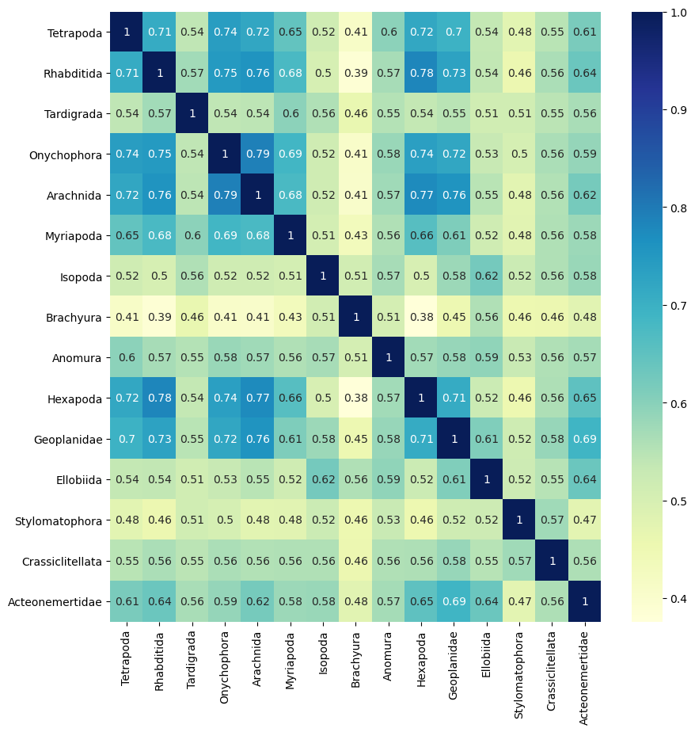
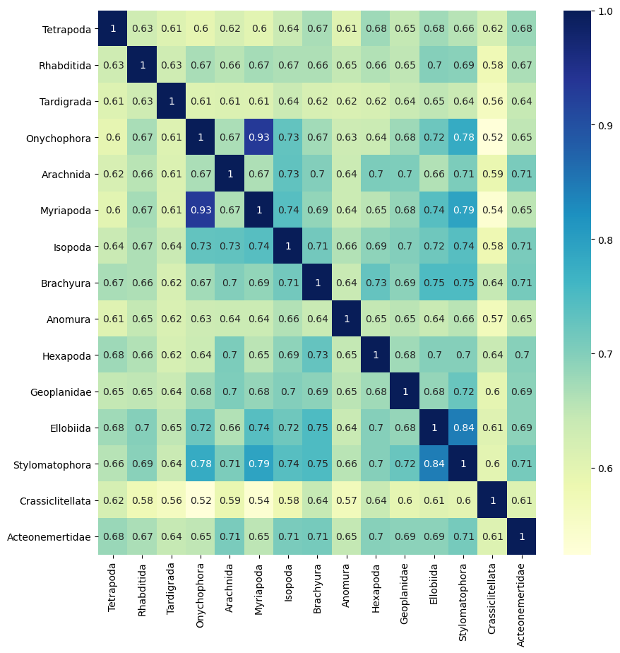

## 1. Description

This directory contains information on the functional convergence analyses using semantic similarity of GO terms and constellatoR.

## 2. Workflow

### Building the Semantic Similarity matrix for ConstellatoR

To test functional convergence between different datasets, we are using **constellatoR** (<https://github.com/MetazoaPhylogenomicsLab/constellatoR>).

There are some incongruences between FANTASIA GO version and the version that constellatoR uses (which depends on the time a dependency is installed and can’t be easily changed). So, we first created a script to estimate the OG-OG semantic similarity matrix that constellatoR will use for creating the functional clusters. This uses pygosemsim (<https://github.com/mojaie/pygosemsim/tree/master>).

[calculate_semsim_fixed.py](calculate_semsim_fixed.py)

</aside>

This script uses as input a directory with all the files (one per OG) containing the GO terms per gene. Then, it estimates the semantic similarity between the different OGs and builds a matrix. It’s optimized as it uses vectorized computation with numpy.

### 1. Functional convergence between gained/lost OGs in independent terrestrialisation events

Let’s try to use only the enriched GO terms and compare directly between clades.

-   calculate_semsim_enriched_gos.py

    ``` python
    #!/usr/bin/env/python
    '''
    Script created by Gemma I. Martinez-Redondo to obtain semantic similarity of GO terms between two lists.
    Usage:
            python calculate_semsim.py -i inputpath [-o outfile.txt] [-c BP] [-g go.obo]
    '''

    from pygosemsim import graph
    from pygosemsim import similarity
    from pygosemsim import term_set
    import functools, argparse, re
    from pathlib import Path
    import pandas as pd
    import numpy as np

    #Define parsing of the command
    def parser():
        args = argparse.ArgumentParser(description='Obtain the semantic similarity matrix of enriched GO terms between a group of entities (OGs, species...). Wang similarity will be used with BMA algortithm for getting a semantic similarity per pair entities (and not per pair of GO terms).')
        args.add_argument('-i', '--inpath', required=True, help="Name of the path containing one file per identity you want to compare functionally (OGs, species,...). One row per GO term. No header.")
        args.add_argument('-o', '--outfile', required=False, help="Path to the output file. If not provided, 'SimMat.out' will be used as default.")
        args.add_argument('-g', '--gofile', required=False, help="Path to the Gene Ontology go.obo file. If not provided, './go' will be used.")
        args.add_argument('-c', '--gocategory', required=False, default="BP", help="GO category for which to obtain the semantic similarity matrix. If not provided, biological process (BP) is used by default. Options: {BP, MF, CC}")
        args=args.parse_args()
        return args

    #Obtain arguments
    inpath = parser().inpath
    outfile = parser().outfile
    gofile = parser().gofile
    gocategory = parser().gocategory

    #Use defaults if optional arguments not given
    if not outfile:
        outfile='SimMat.out'

    if not gofile:
        gofile='/mnt/netapp2/Store_csbyegim/Metazoa_OGs/constellatoR/go_2022'
    else:
        p=Path(gofile)
        extensions="".join(p.suffixes)
        gofile=str(p).replace(extensions, "")

    if not gocategory:
        gocategory = "BP"
    else:
        if gocategory not in ["BP","MF","CC"]:
            raise Exception("Invalid GO category provided! Please, select one among the following: {BP, MF, CC}")

    #Read GO file
    G=graph.from_resource(gofile)

    #Define functions
    #Method for semantic similarity
    sf = functools.partial(term_set.sim_func, G, similarity.wang)
    #Obtain go terms per input file (output: DataFrame)
    def obtain_go_terms_per_file(file):
        df = pd.read_csv(file, sep=" ", header=None)
        df.columns = ['GO_terms','p_value']
        # Convert the GO_terms column into a single list
        all_go_terms = df['GO_terms'].explode().dropna().tolist()
        # Convert it into a DataFrame
        df_go = pd.DataFrame({'GO_terms': all_go_terms})
        return df_go

    def parse_obo(FILEPATH):
        regex = re.compile("alt_id: (GO:.*)\n")
        with open(FILEPATH, "r") as fread:
            data = [
                [y]
                + [
                    y.split(": ")[1].strip()
                    for y in x.strip().split("\n")
                    if y and ":" in y
                ][1:3]
                for x in fread.read().replace(";", ",").split("\n\n")
                if x and ("[Term]" in x)
                for y in (
                    [x.strip().split("\n")[1].split(": ")[
                        1].strip()] + regex.findall(x)
                )
            ]
        return {x[0]: x[1::] for x in data}

    def obtain_category_for_goterms(golist,G):
        new_golist={}
        for goterm in golist:
            if obo.get(goterm, None) is not None:
                category = obo[goterm][1]
                if category not in new_golist.keys():
                    new_golist[category]=[goterm]
                else:
                    new_golist[category].append(goterm)
        return new_golist

    obo=parse_obo(gofile+".obo")

    # Load GO terms per OG (file)
    file_list = [f for f in Path(inpath).iterdir()]
    og_dict = {}
    for file in file_list:
        OG=file.stem
        og_dict[OG]=obtain_go_terms_per_file(file)

    # Get OG-GOs dataframe
    og_final = pd.DataFrame({
        'OG': list(og_dict.keys()),
        'GO_terms': [df['GO_terms'].tolist() for df in og_dict.values()]
    })

    # Get information of GO categories
    og_final[gocategory] = og_final['GO_terms']
    og_final = og_final.drop(columns=['GO_terms'])

    # Now, let's get for the requested category, the OG-OG matrix to get the semantic similarity
    # Extract OG names and GO term lists of the specified categgory
    og_list = og_final['OG'].values
    go_terms = np.array(og_final[gocategory].values, dtype=object)  # Store GO terms as a NumPy array
    # Initialize an empty NumPy matrix (fill with NaN to indicate uncomputed values)
    sim_matrix = np.full((len(og_list), len(og_list)), np.nan)
    # Compute only the upper triangle (excluding diagonal)
    rows, cols = np.triu_indices(len(og_list))  # k=1 excludes diagonal
    # Vectorized computation for upper triangle
    vec_sim = np.frompyfunc(lambda x, y: term_set.sim_bma(x, y, sf), 2, 1)
    sim_matrix[rows, cols] = vec_sim(go_terms[rows], go_terms[cols])
    # Fill lower triangle
    sim_matrix[cols, rows] = sim_matrix[rows, cols]
    # Convert to a Pandas DataFrame
    sim_df = pd.DataFrame(sim_matrix, index=og_list, columns=og_list)

    # Save to file
    sim_df.to_csv(outfile, sep="\t", header=True, index=True, na_rep='NA')
    ```

In this case, the input is the output file of the topGO enrichment (plus ordmeta). Files have GOs in first column and p-values in the second. Just for one GO category, meaning that we will need to put as argument if it’s BP, MF or CC.

A. Gains

-   Semantic similarity between clades using enriched GO terms

    We have previously done a GO enrichment per terrestrial clade. So, we have a subset of terms that we can use to test for convergence, to see if the GO terms that are significantly enriched on those clades are also similar between clades.

    Let’s rename the files and execute a modified version of the calculate_semsim.py script above.

    ``` bash
    # Copy files (in local computer)
    rsync -av --progress /home/metazomics/Metazoa_analyses/Phylogenetic_trees_and_analyses/GO_enrichment/Results/gene_gain/per_node/BP_gained_*_topgo_enrichment.txt csbyegim@ft3.cesga.es:/mnt/netapp2/Store_csbyegim/Metazoa_OGs/constellatoR/gains/enriched_GO_terms_per_node

    # Remove species-specific files (in /mnt/netapp2/Store_csbyegim/Metazoa_OGs/constellatoR/gains/enriched_GO_terms_per_node)
    rm BP_gained_ANGR1_topgo_enrichment.txt BP_gained_CYCO1_topgo_enrichment.txt BP_gained_DRAW1_PELO1_Crassi_topgo_enrichment.txt BP_gained_ECRY2_topgo_enrichment.txt BP_gained_ETES1_topgo_enrichment.txt BP_gained_HRPE1_topgo_enrichment.txt BP_gained_OVER1_topgo_enrichment.txt BP_gained_PELE1_topgo_enrichment.txt BP_gained_PELO1_Crass_topgo_enrichment.txt BP_gained_PHEI1_topgo_enrichment.txt BP_gained_PPUN2_topgo_enrichment.txt BP_gained_RVAR1_topgo_enrichment.txt BP_gained_TRLO1_topgo_enrichment.txt

    # Rename files (in /mnt/netapp2/Store_csbyegim/Metazoa_OGs/constellatoR/gains/enriched_GO_terms_per_node)
    rename "BP_gained_" "" *
    rename "_topgo_enrichment" "" *

    # Get the semantic similarity matrix
    module load cesga/2020 python/3.9.9

    source $STORE2/Dark_proteome/Isoforms_Semsim/pygosemsim_venv/bin/activate

    WD=/mnt/netapp2/Store_csbyegim/Metazoa_OGs/constellatoR/gains
    INPUT_FOLDER=$WD/enriched_GO_terms_per_node/

    cd $WD

    python $WD/../calculate_semsim_enriched_gos.py -i $INPUT_FOLDER -o $WD/gains_GO_enrich_nodes_SimMat.out
    ```

    This script finished in 1h 40 mins. Let’s plot these results:

    ``` python
    import seaborn as sns
    import matplotlib.pyplot as plt
    from mpl_toolkits.axes_grid1.axes_divider import make_axes_locatable
    import matplotlib.colorbar
    import pandas as pd

    df_go = pd.read_csv("gains_GO_enrich_nodes_SimMat.out", sep="\t", index_col=0)
    #Change order of columns/rows (to follow phylogeny)
    desired_order = ["Tetrapoda","Rhabditida","Tardigrada","Onychophora","Arachnida","Myriapoda","Isopoda","Brachyura","Anomura","Hexapoda","Geoplanidae","Ellobiida","Stylomatophora","Crassiclitellata","Acteonemertidae"]  # Replace with actual row/column names
    df_go = df_go.reindex(index=desired_order, columns=desired_order)

    #For 2 triangular heatmaps
    #sns.heatmap(df_go,annot=True,mask=matrix_go,cmap="BuPu")
    #sns.heatmap(df_clusters,annot=True,mask=matrix_clusters,cmap="YlGnBu")

    plt.figure(figsize=(10, 10))
    sns.heatmap(df_go,annot=True,cmap="YlGnBu")
    #plt.xticks(rotation=45)
    #plt.yticks(rotation=45)
    plt.savefig("GO_enrich_gains_convergence_nodes.svg",bbox_inches="tight")
    ```

    

B. Losses

As losses are much higher than gains, there are too many OGs. We will proceed with the same approach that we used in the end for gains: use the GO terms enriched in the losses.

``` bash
# Copy files (in local computer)
rsync -av --progress /home/metazomics/Metazoa_analyses/Phylogenetic_trees_and_analyses/GO_enrichment/Results/gene_loss/per_node/BP_lost_*_topgo_enrichment.txt csbyegim@ft3.cesga.es:/mnt/netapp2/Store_csbyegim/Metazoa_OGs/constellatoR/losses/enriched_GO_terms_per_node

# Remove species-specific files (in /mnt/netapp2/Store_csbyegim/Metazoa_OGs/constellatoR/losses/enriched_GO_terms_per_node)
rm BP_lost_ANGR1_topgo_enrichment.txt BP_lost_CYCO1_topgo_enrichment.txt BP_lost_DRAW1_PELO1_Crassi_topgo_enrichment.txt BP_lost_ECRY2_topgo_enrichment.txt BP_lost_ETES1_topgo_enrichment.txt BP_lost_HRPE1_topgo_enrichment.txt BP_lost_OVER1_topgo_enrichment.txt BP_lost_PELE1_topgo_enrichment.txt BP_lost_PELO1_Crass_topgo_enrichment.txt BP_lost_PHEI1_topgo_enrichment.txt BP_lost_PPUN2_topgo_enrichment.txt BP_lost_RVAR1_topgo_enrichment.txt BP_lost_TRLO1_topgo_enrichment.txt

# Rename files (in /mnt/netapp2/Store_csbyegim/Metazoa_OGs/constellatoR/losses/enriched_GO_terms_per_node)
rename "BP_lost_" "" *
rename "_topgo_enrichment" "" *

# Get the semantic similarity matrix
module load cesga/2020 python/3.9.9

source $STORE2/Dark_proteome/Isoforms_Semsim/pygosemsim_venv/bin/activate

WD=/mnt/netapp2/Store_csbyegim/Metazoa_OGs/constellatoR/gains
INPUT_FOLDER=$WD/enriched_GO_terms_per_node/

cd $WD

python $WD/../calculate_semsim_enriched_gos.py -i $INPUT_FOLDER -o $WD/gains_GO_enrich_nodes_SimMat.out
```

``` python
import seaborn as sns
import matplotlib.pyplot as plt
from mpl_toolkits.axes_grid1.axes_divider import make_axes_locatable
import matplotlib.colorbar
import pandas as pd

df_go = pd.read_csv("losses_GO_enrich_nodes_SimMat.out", sep="\t", index_col=0)
#Change order of columns/rows (to follow phylogeny)
desired_order = ["Tetrapoda","Rhabditida","Tardigrada","Onychophora","Arachnida","Myriapoda","Isopoda","Brachyura","Anomura","Hexapoda","Geoplanidae","Ellobiida","Stylomatophora","Crassiclitellata","Acteonemertidae"]  # Replace with actual row/column names
df_go = df_go.reindex(index=desired_order, columns=desired_order)

#For 2 triangular heatmaps
#sns.heatmap(df_go,annot=True,mask=matrix_go,cmap="BuPu")
#sns.heatmap(df_clusters,annot=True,mask=matrix_clusters,cmap="YlGnBu")

plt.figure(figsize=(10, 10))
sns.heatmap(df_go,annot=True,cmap="YlGnBu")
#plt.xticks(rotation=45)
#plt.yticks(rotation=45)
plt.savefig("GO_enrich_losses_convergence_nodes.svg",bbox_inches="tight")
```



# 

### 2. Functional convergence of the hub genes involved in the response to a stress condition between all species

1.  We calculated the distance matrices the: [calculate_semsim_fixed.py](https://github.com/MetazoaPhylogenomicsLab/Martinez-Redondo-Eleftheriadi_et_al_2025_Genomic_basis_animal_terrestrialization/blob/main/Semantic_similarity_ConstellatoR/calculate_semsim_fixed.py){.uri}

    The input files along with the resulted matrices can be found in figshare: Semantic_similarity_ConstellatoR/perSpecies_perExperiment

2.  The distance matrices were subsequently clustered in constellatoR using the Affinity Propagation cluster algorithm to identify groups of species exhibiting high functional similarity.

``` r
library(constellatoR)
library(ggplot2)
library(dplyr)
library(tibble)

experiment = "CD" #Change experiment 
BasePath = paste0("./constellatoR/Per_Species_Per_Experiment/", experiment, "/", experiment, "_TETR") 
setwd(BasePath) 
# Habitat dictionary
habitat_dict <- list(
  "Terrestrial" = c("EAND", "PLAE", "CELE", "TPIS", "LEPN", "ONUN", "PEAU"),
  "Aquatic" = c("COCO", "HMED", "MISO", "LMAR", "PTUR", "PACU", "SPEC1", "TETR", "SMED")
)

# Load files and process
experiment_files <- list.files(pattern = "\\_GO_terms.txt$")
processedExperiment <- lapply(experiment_files, function(x) {
  file_path <- paste(x, sep = "")
  
  # Check if the file is empty
  if (file.info(file_path)$size == 0) {
    warning(paste("Skipping empty file:", x))
    return(NULL)
  }
  
  temp <- read.delim(file_path, header = FALSE)
  
  OGGOs <- data.frame(GOs = unique(unlist(strsplit(temp[, 2], ", "))), 
                      OGs = sub("_GO_terms.txt", "", x))
  species <- sapply(strsplit(temp[, 1], "_"), "[[", 1)
  out <- list(OGGOs, species)
})
# Remove NULL entries (empty files)
processedExperiment <- Filter(Negate(is.null), processedExperiment)
# Combine all OGs and GOs
OGGOs <- lapply(processedExperiment, function(x) x[[1]])
expOGGOs <- do.call(rbind, OGGOs)
species <- lapply(processedExperiment, function(x) x[[2]])

# Function to determine habitat type for each OG
get_habitat <- function(species_list) {
  terrestrial <- any(species_list %in% habitat_dict$Terrestrial)
  aquatic <- any(species_list %in% habitat_dict$Aquatic)
  
  if (terrestrial & aquatic) {
    return("Mixed")
  } else if (terrestrial) {
    return("Terrestrial")
  } else if (aquatic) {
    return("Aquatic")
  } else {
    return("Unknown")  # If species are not found in either category
  }
}

# # Create a named vector for OG habitat classification
# og_habitats <- setNames(
#   sapply(processedExperiment, function(entry) get_habitat(entry[[2]])),
#   sapply(processedExperiment, function(entry) unique(entry[[1]]$OGs))
# )

# Create a named vector for OG habitat classification with override for TETR
og_habitats <- setNames(
  sapply(seq_along(processedExperiment), function(i) {
    entry <- processedExperiment[[i]]
    og_name <- unique(entry[[1]]$OGs)
    
    # If the OG name includes "TETR", override species list with just "TETR"
    if (grepl("TETR", og_name)) {
      return(get_habitat("TETR"))
    } else {
      return(get_habitat(entry[[2]]))
    }
  }),
  sapply(processedExperiment, function(entry) unique(entry[[1]]$OGs))
)

# Print the result
print(og_habitats)

# Semantic similarity and clustering
# Calculated semantic similarity using calculate_semsim_fixed.py

simMat <- read.csv(paste0(BasePath, "/semSim_species_", experiment, ".txt"), 
                   header = TRUE, stringsAsFactors = FALSE, sep="\t",row.names = 1)

# Convert the data frame to a numeric matrix (ensures type is double)
simMat <- as.matrix(simMat)
clusters <- clusterOGs(simMat)
rownames(clusters) <- gsub("_GO_terms", "", rownames(clusters))
clusters$Cluster_exemplar <- gsub("_GO_terms", "", clusters$Cluster_exemplar)

# Annotate OGs
annotation <- annotateOGs(expOGGOs, unique(expOGGOs$OGs), cores=1)
stopwords <- system.file("extdata/bio-stopwords.txt", package="constellatoR")
wcl <- getWordcloud(expOGGOs, clusters = clusters, toExclude = stopwords)

# Merge annotation with wordcloud
annot <- merge(annotation, wcl, by.x = 0, by.y = 0)
row.names(annot) <- annot[, 1]
annot <- annot[, -1]

# Final color-coding for groups (Aquatic, Terrestrial)
annot <- data.frame(annot, og_habitats = og_habitats)

species_shapes <- c(
  "CELE" = 0,   
  "COCO" = 1,   
  "EAND" = 2,   
  "HMED" = 3,   
  "LEPN" = 4,   
  "LMAR" = 5, 
  "MISO" = 6,   
  "ONUN" = 7,   
  "PACU" = 8,   
  "PEAU" = 16,   
  "PLAE" = 10,  
  "PTUR" = 11,  
  "SMED" = 12,  
  "SPEC1" = 17, 
  "TETR" = 14,  
  "TPIS" = 15 
)
present_species <- intersect(unique(rownames(clusters)), 
                             names(species_shapes))
filtered_shapes <- species_shapes[present_species]

p <- plotConstellation(clusters, annot, term = "BP1", color = ("og_habitats"), annot$Species) +
  scale_color_manual(values = c("#005f73","#BB3E03")) +
  scale_shape_manual(values = filtered_shapes) +
  ggtitle(paste0("Constellation Plot Per Species for Experiment ", experiment)) +  # Add title
  theme(plot.title = element_text(hjust = 0.5, size = 10, face = "bold"))  # Center and style title
p

pdf(file=paste0(experiment, "_perSpecies_constellatoR_plot_smaller.pdf"), width=10, height=10)
print(p)
dev.off()

svg(file=paste0(experiment, "_perSpecies_constellatoR_plot.svg"), width=16, height=8)
print(p)
dev.off()
```

### 3. Functional convergence of the hub-containing OGs involved in the response to each stress condition

1.  Here, we calculated the distance matrices between hub-containing OGs using the: [calculate_semsim_fixed.py](https://github.com/MetazoaPhylogenomicsLab/Martinez-Redondo-Eleftheriadi_et_al_2025_Genomic_basis_animal_terrestrialization/blob/main/Semantic_similarity_ConstellatoR/calculate_semsim_fixed.py){.uri}

2.  Removed the OGs that returned NA values using: [clean_semSim_file.py](constellatoR%20206f4c09425a804abee8ed634a725794/clean_semSim_file.py)

    The resulted clean matrices along with the input files of the analysis can be found in figshare: Semantic_similarity_ConstellatoR/perOG_perExperiment

3.  The distance matrices per experiment were subsequently clustered in constellatoR using the Affinity Propagation cluster algorithm to identify groups of OGs exhibiting high functional similarity.

``` r
library(constellatoR)
library(ggplot2)
library(dplyr)
library(tibble)
library(ggnewscale)
library(ggrepel)
library(paletteer)
library(rlang)
library(writexl)

experiment = "CD" #Change experiment accordingly
BasePath = paste0("/constellatoR/perOG_perExperiment/", experiment)
setwd(BasePath)

# Habitat dictionary
habitat_dict <- list(
  "Terrestrial" = c("EAND", "PLAE", "CELE", "TPIS", "LEPN", "ONUN", "PEAU"),
  "Aquatic" = c("COCO", "HMED", "MISO", "LMAR", "PTUR", "PACU", "SPEC1", "TMEL", "TLON", "SMED")
)

# Read the similarity file so we can filter the files later, since not all OGs are in semSim matrix
simMat <- read.csv(paste0(BasePath, "/semSim_perOG_", experiment, "_cleaned.txt"), 
                   header = TRUE, sep = "\t", row.names = 1)
simMat <- as.matrix(simMat)
any(is.na(simMat))

# Load (filtered) files and process
experiment_files <- list.files(pattern = paste0("^", experiment, "_OG"))
filtered_experiment_files <- paste(rownames(simMat), ".txt", sep = "")

processedExperiment <- lapply(filtered_experiment_files, function(x) {
  file_path <- paste(x, sep = "")
  
  # Check if the file is empty
  if (file.info(file_path)$size == 0) {
    warning(paste("Skipping empty file:", x))
    return(NULL)
  }
  
  temp <- read.delim(file_path, header = FALSE, skip=1)
  
  # Extract "OGXXXXX" from the filename
  og_id <- sub("\\.txt", "\\1", x)
  
  OGGOs <- data.frame(GOs = unique(unlist(strsplit(temp[, 2], ", "))), 
                      OGs = og_id)
  species <- sapply(strsplit(temp[, 1], "_"), "[[", 1)
  
  out <- list(OGGOs, species)
})

# Remove NULL entries (empty files)
processedExperiment <- Filter(Negate(is.null), processedExperiment)
OGGOs <- lapply(processedExperiment, function(x) x[[1]])
expOGGOs <- do.call(rbind, OGGOs)
species <- lapply(processedExperiment, function(x) x[[2]])

# Habitat classification
get_habitat <- function(species_list) {
  terrestrial <- any(species_list %in% habitat_dict$Terrestrial)
  aquatic <- any(species_list %in% habitat_dict$Aquatic)
  if (terrestrial & aquatic) return("Mixed")
  else if (terrestrial) return("Terrestrial")
  else if (aquatic) return("Aquatic")
  else return("Unknown")
}

og_habitats <- setNames(
  sapply(processedExperiment, function(entry) get_habitat(entry[[2]])),
  sapply(processedExperiment, function(entry) unique(entry[[1]]$OGs))
)

clusters <- clusterOGs(simMat)
rownames(clusters) <- gsub("_GO_terms", "", rownames(clusters))
clusters$Cluster_exemplar <- gsub("_GO_terms", "", clusters$Cluster_exemplar)

# Annotation and wordcloud
annotation <- annotateOGs(expOGGOs, unique(expOGGOs$OGs), cores=7, ignoreLevels = NULL)
print(length(og_habitats)) #Check the difference after filtering NA values
print(dim(annotation))
stopwords <- system.file("extdata/bio-stopwords.txt", package = "constellatoR")
wcl <- getWordcloud(expOGGOs, clusters = clusters, toExclude = stopwords)

# Merge annotation with wordcloud
annot <- merge(annotation, wcl, by.x = 0, by.y = 0)
row.names(annot) <- annot[, 1]
annot <- annot[, -1]

# Filter the og_habitats list to keep only OGs in annotation rownames
filtered_og_habitats <- og_habitats[names(og_habitats) %in% rownames(annot)]
# Final color-coding for groups (Aquatic, Terrestrial, Mixed)
annot <- merge(annot, og_habitats, by.x = 0, by.y = 0)

p <- plotConstellation(clusters, annot, term = "BP1", color = ("y")) +
  geom_point(data = clusters, aes(x = V1, y = V2), size = 0.01, inherit.aes = FALSE) +
  #scale_color_manual(values = c("Aquatic" = "#005f73", "Terrestrial" = "#BB3E03", "Mixed" = "red")) +
  ggtitle(paste0("Constellation Plot per OG for Experiment ", experiment)) +  # Add title
  theme(plot.title = element_text(hjust = 0.5, size = 10, face = "bold"))  # Center and style title
p

pdf(file=paste0(experiment, "_perOG_constellatoR_plot.pdf"), width=16, height=8) 
print(p)
dev.off()

# Summarize clusters by habitat
og_habitats_df <- data.frame(Cluster_exemplar = names(og_habitats), 
                             Habitat = unlist(og_habitats), row.names = NULL)
clusters_noIndex <- clusters %>% rownames_to_column(var = "Cluster")

clusters_withHabitat <- clusters_noIndex %>%
  left_join(og_habitats_df, by = c("Cluster" = "Cluster_exemplar"))

clusters_summary <- clusters_withHabitat %>%
  group_by(Cluster_exemplar) %>%
  summarise(
    Cluster = paste(unique(Cluster), collapse = ", "),
    Habitat = paste(unique(Habitat), collapse = ", ")
  )
write.table(clusters_summary, paste0(experiment, "_clusters_summary.tsv"), sep = "\t", row.names = FALSE, quote = FALSE)
write_xlsx(clusters_summary, paste0(experiment, "_clusters_summary.xlsx"))
```

The output tables can be found in Supplementary Tables.
