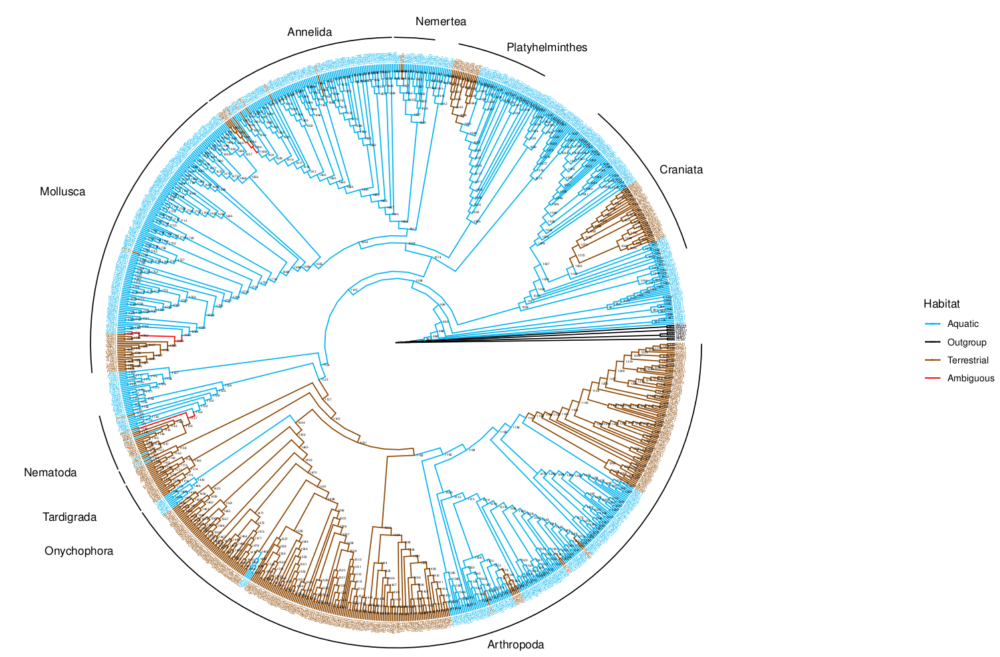

## 1. Description

This directory contains the species tree, habitat and taxonomic information, as well as scripts and explanation for the ancestral habitat reconstruction.

## 2. Workflow

### Resolving species tree polytomies

Literature could not resolve the topology of all species, as we only had the genus name for some of them and there were other species from other papers whose position relative to that sample was not known. Thus, we randomly selected the species that is the outgroup using ETE3 (**`t.resolve_polytomy()`**).

### Adding node names to the species tree

As we are working with different methods in Python and R, it would be great if we could trace back some of the results or compare different analyses involving the species tree. This is especially important as different libraries may use different tree traversing algorithms as default, and when labeling nodes based on numbers, these can differ a lot. For that, we will save a version of the species tree with pre-computed node names/numbers.

```python
from ete3 import PhyloTree

#Read species tree
#species_tree="metazoa_outgroups_sp_tree.nwk" #Old tree without Klara's species
species_tree="metazoa_outgroups_sp_tree_plus_Klara_no_PGOT1.nwk"
t=PhyloTree(species_tree)

#Add node names
counter=len(t.get_leaves())+1 #971 #The first 970 would be the species (leaves)
t.name = counter #Name the root
for node in t.traverse("levelorder"):
	if not node.is_leaf():
		node.name = counter
		counter+=1

#Write with node names
#t.get_common_ancestor(["LAMP1","NNAJ1"]).write(format=1, outfile="test_tree_node_names.nwk") #Just Metazoa, no outgroups
t.write(format=8, outfile="metazoa_sp_tree_node_names.nwk")
```

For reading the tree with the node names, we need to specify the format:

```python
t=PhyloTree(species_tree, format=8)
```

| **FORMAT** | **DESCRIPTION** |
| --- | --- |
| 0 | flexible with support values |
| 1 | flexible with internal node names |
| 2 | all branches + leaf names + internal supports |
| 3 | all branches + all names |
| 4 | leaf branches + leaf names |
| 5 | internal and leaf branches + leaf names |
| 6 | internal branches + leaf names |
| 7 | leaf branches + all names |
| 8 | all names |
| 9 | leaf names |
| 100 | topology only |

In iTOL, the node names are not read correctly if they are numbers. Thus, we can add an N before to fix this.

```python
sed "s/)/)N/g" metazoa_sp_tree_node_names.nwk > metazoa_sp_tree_node_names_itol.nwk
```

## Habitat ancestral reconstruction for plotting

For each species, we have one assigned habitat (aquatic or terrestrial). This information came from WORMS or the literature. In the case of species with an aquatic larval stage and a terrestrial adult stage, we considered the species terrestrial. In addition, some species that lived in an aquatic environment but still had most adaptations to life on land were also considered terrestrial (i.e. *Argyroneta aquatica* and *Strigamia maritima*). With the same logic, horseshoe crabs that have book gills were considered aquatic even if they go to beaches for reproduction. This simplification will help us to get a more general overview of the convergent terrestrialization events across animals. Otherwise, considering a more gradual transition is complicated based on the profound physiological differences between phyla. For example, the presence/absence of gills as a respiratory system can only be said in lineages with large animals. Planarians, for instance, either aquatic or terrestrial, breathe through their skin. This makes the selection of morphological and physiological characters for this gradual classification hard.

To talk about terrestrialization, we need to consider in which node/branch the transition happens. As we don’t have the calibrated species phylogeny we can’t apply the most traditional and used methods, that account for the distance between species. So, just to have a more standardized and reproducible way to calculate the ancestral habitats, we’ll stick to parsimony.

Inside the package we used to infer parsimony (paleotree), there are 2 methods: MPR and ACCTRAN. "MPR" (the default) relies on reconstructing the states at each internal node by re-rooting at that node. "ACCTRAN", the "accelerated transitions" algorithm, favors character reversal over independent gains when there is ambiguity. In the output, this translates to obtaining ambiguous results with MPR (in red below) while ACCTRAN selects one of the two options. From the information we know from literature, we know that the ACCTRAN reconstruction of those nodes/branches that are ambiguous in MPR is wrong. So, we’ll proceed with the MPR.

- R script for doing the habitat ancestral reconstruction and plots
    
    ```r
    library(ape)
    library(dplyr)
    library(ggplot2)
    library(ggtree)
    library(paleotree)
    setwd("~/Metazoa_analyses/Ancestral_habitat")
    
    #Load tree
    tr <- read.tree(file = "metazoa_sp_tree_node_names.nwk")
    
    #Load habitat information
    hab_df <- read.table(file="species_habitat.txt", header=FALSE)
    hab_df <- rbind(hab_df, cbind(tr$tip.label[!tr$tip.label %in% hab_df$V1],rep("Outgroup",length(tr$tip.label[!tr$tip.label %in% hab_df$V1]))))
    hab <- unlist(hab_df[2])
    names(hab) <- as.vector(unlist(hab_df[1]))
    
    #Infer ancestral nodes states using 2 parsimony methods implemented in the paleotree library
    anc_states_MPR <- ancPropStateMat(hab, tr, type="MPR")
    
    #Set important clades for plotting (terrestrial phyla)
    craniata<-MRCA(tr,c("PETM1","HSAP1"))
    nematoda<-MRCA(tr,c("TOBR1","CELE"))
    tardigrada<-MRCA(tr,c("ESIG1","PMET1"))
    onychophora<-MRCA(tr,c("EPTR1","OGIL1"))
    arthropoda<-MRCA(tr,c("PFLA1","DMEL1"))
    platyhelminthes<-MRCA(tr,c("SLEU1","ONUN"))
    mollusca<-MRCA(tr,c("HAEG1","CASP1"))
    annelida<-MRCA(tr,c("MPIT1","NNAJ1"))
    nemertea<-MRCA(tr,c("TPOL1","LEPN"))
    
    #Plot for MPR ancestral reconstruction
    habitat_MPR <- apply(anc_states_MPR, 1, function(x) {
      if (x[1] == 1) {
        return("Aquatic")
      } else if (x[2] == 1) {
        return("Outgroup")
      } else if (x[3] == 1) {
        return("Terrestrial")
      }  else {
        return(NA) # in case neither column is 1
      }
    })
    node_states_MPR <- data.frame(node = rownames(anc_states_MPR), state = habitat_MPR)
    # Basic ggtree plot with circular layout
    p <- ggtree(tr, layout = "circular", branch.length="none") 
    # Add the node labels (optional, if you want to show node numbers)
    p <- p + geom_text2(aes(subset = !isTip, label = node), hjust = -0.3, size = 1, color="black")
    # Merge node states (ancestral reconstruction data) with the ggtree plot data
    p$data <- merge(p$data, node_states_MPR, by.x = "node", by.y = "node", all.x = TRUE)
    # Color the branches according to the habitat state (0 = Aquatic, 1 = Terrestrial)
    p <- p + aes(color = as.factor(state))
    # Define custom colors for the states
    p <- p + scale_color_manual(values = c("Aquatic" = "deepskyblue2", "Terrestrial" = "darkorange4", "Outgroup"="black"),
                                labels = c("Aquatic", "Outgroup", "Terrestrial", "Ambiguous"),
                                na.value = "red",
                                name= "Habitat")
    # Add tip labels (labels for the species at the tips of the tree)
    p <- p + geom_tiplab(size = 1, align = TRUE)
    # Adjust title, legend, etc.
    p <- p + theme(legend.position = "right") +
             ggtitle("Ancestral Habitat Reconstruction (MPR)") +
             theme(plot.title = element_text(hjust = 0.5))
    #Add labels for phyla that contain terrestrial species
    p <- p + geom_cladelab(node=craniata, label="Craniata", offset=3, lineheight=5, offset.text=1) +
              geom_cladelab(node=nematoda, label="Nematoda", offset=3, lineheight=5, offset.text=12) +
              geom_cladelab(node=tardigrada, label="Tardigrada", offset=3, lineheight=5, offset.text=12) +
              geom_cladelab(node=onychophora, label="Onychophora", offset=3, lineheight=5, offset.text=14) +
              geom_cladelab(node=arthropoda, label="Arthropoda", offset=3, lineheight=5, offset.text=1) +
              geom_cladelab(node=platyhelminthes, label="Platyhelminthes", offset=3, lineheight=5, offset.text=1) +
              geom_cladelab(node=mollusca, label="Mollusca", offset=3, lineheight=5, offset.text=11) +
              geom_cladelab(node=annelida, label="Annelida", offset=3, lineheight=5, offset.text=3) +
              geom_cladelab(node=nemertea, label="Nemertea", offset=3, lineheight=5, offset.text=2)
    # Show the plot
    pdf("/home/metazomics/Metazoa_analyses/Ancestral_habitat/MPR_ancestral_habitat.pdf",width=15, height=15)
    print(p)
    dev.off()
    ```
    



In the MPR results, we are getting ambiguous reconstructions in 3 lineages: nematodes, mollusks, and annelids. We are also getting results that we know are not true, such as the inference of the ancestor of all arthropods or all tardigrades to be terrestrial. We will use information from previous studies to correct these errors.


In the case of tardigrades, no studies are showing the ancestral habitat. Given their semi-aquatic lifestyle, I will still assume that the ancestor was aquatic if there is not a monophyletic group of all terrestrial species.

Perhaps the most comprehensive classification is the one from this paper (https://academic.oup.com/gbe/article/16/1/evad217/7454252) where they don’t infer the ancestral habitat.

In the case of annelids, I wanted to use information from [Erséus et al. (2019)](https://onlinelibrary.wiley.com/doi/full/10.1111/zsc.12426). For the phylogeny, I used the tree in Figure 1 (TreSpEx-and-BaCoCa-filtered 50%). However, for the calibration and ancestral habitat reconstruction they used a different tree (75% TreSpEx-and-BaCoCa-filtered). Both trees are quite similar except in some branches, which, unfortunately, include the ones I’m interested in (*Delaya leruthi, Pelodrilus darlingensis,* and *Drawida sp.*). In their habitat reconstruction *Drawida* is inside Crassiclitellata, while in the other one, it is not. I will leave those ambiguous branches as aquatic then.

For nematoda, there is no paper that infers the ancestral state. Given that one paper suggested more than 30 transition events ([Holterman et al., 2019](https://academic.oup.com/biolinnean/article/128/3/756/5568356#164764971)), and that in the group in question (Plectida), there are terrestrial and aquatic clades (Sup. Fig 1), I will assume that the ancestors in the ambiguous branches were aquatic. At least branch 1116 is aquatic for sure, but 1117 could also be terrestrial. In the 30 events paper, they did not distinguish between terrestrial and freshwater, given the gradient of habitats, so, given that there are some marine Plectida in the sister group, I will assume that the ancestor was aquatic. 


Plectida clade in the S1 of the 30 events transitions in nematodes. Blue is marine. Green is freshwater/terrestrial

- R script for manually correcting ancestral habitat reconstruction (after executing previous code)
    
    ```r
    anc_states_MPR <- ancPropStateMat(hab, tr, type="MPR")
    #Panarthropoda (fossils and old info)
    anc_states_MPR[arthropoda,] <- c(1,0,0) #Aquatic
    anc_states_MPR[1444,] <- c(1,0,0) #Aquatic
    anc_states_MPR[1182,] <- c(1,0,0) #Aquatic
    anc_states_MPR[1165,] <- c(1,0,0) #Aquatic
    anc_states_MPR[1157,] <- c(1,0,0) #Aquatic
    anc_states_MPR[tardigrada,] <- c(1,0,0) #Aquatic
    anc_states_MPR[1159,] <- c(1,0,0) #Aquatic
    anc_states_MPR[1160,] <- c(1,0,0) #Aquatic
    anc_states_MPR[1159,] <- c(1,0,0) #Aquatic
    #Mollusca (https://royalsocietypublishing.org/doi/10.1098/rspb.2021.1855)
    anc_states_MPR[1789,] <- c(1,0,0) #Aquatic
    anc_states_MPR[1790,] <- c(1,0,0) #Aquatic
    anc_states_MPR[1791,] <- c(1,0,0) #Aquatic
    anc_states_MPR[1792,] <- c(1,0,0) #Aquatic
    #Nematoda
    anc_states_MPR[1137,] <- c(1,0,0) #Aquatic
    anc_states_MPR[1138,] <- c(1,0,0) #Aquatic
    #Annelida (https://onlinelibrary.wiley.com/doi/full/10.1111/zsc.12426)
    anc_states_MPR[1939,] <- c(1,0,0) #Aquatic
    anc_states_MPR[1940,] <- c(1,0,0) #Aquatic
    
    habitat_MPR <- apply(anc_states_MPR, 1, function(x) {
      if (x[1] == 1) {
        return("Aquatic")
      } else if (x[2] == 1) {
        return("Outgroup")
      } else if (x[3] == 1) {
        return("Terrestrial")
      }  else {
        return(NA) # in case neither column is 1
      }
    })
    node_states_MPR <- data.frame(node = rownames(anc_states_MPR), state = habitat_MPR)
    # Basic ggtree plot with circular layout
    p <- ggtree(tr, layout = "circular") 
    # Add the node labels (optional, if you want to show node numbers)
    #p <- p + geom_text2(aes(subset = !isTip, label = node), hjust = -0.3, size = 1, color="black") #Node ids, same as in MPR ancestral. For using node labels as depicted in the original input tree, use the following line instead
    p <- p + geom_text2(aes(subset = !isTip, label = c(tr$tip.label,tr$node.label)), hjust = -0.3, size = 1, color="black")
    # Merge node states (ancestral reconstruction data) with the ggtree plot data
    p$data <- merge(p$data, node_states_MPR, by.x = "node", by.y = "node", all.x = TRUE)
    # Color the branches according to the habitat state (0 = Aquatic, 1 = Terrestrial)
    p <- p + aes(color = as.factor(state))
    # Define custom colors for the states
    p <- p + scale_color_manual(values = c("Aquatic" = "deepskyblue2", "Terrestrial" = "darkorange4",  "Outgroup"="black"),
                                labels = c("Aquatic", "Outgroup", "Terrestrial", "Ambiguous"),
                                na.value = "red",
                                name= "Habitat")
    # Add tip labels (labels for the species at the tips of the tree)
    p <- p + geom_tiplab(size = 1, align = TRUE)
    # Adjust title, legend, etc.
    p <- p + theme(legend.position = "right") +
             ggtitle("Ancestral Habitat Reconstruction (MPR)") +
             theme(plot.title = element_text(hjust = 0.5))
    #Add labels for phyla that contain terrestrial species
    p <- p + geom_cladelab(node=craniata, label="Craniata", offset=3, lineheight=5, offset.text=1) +
              geom_cladelab(node=nematoda, label="Nematoda", offset=3, lineheight=5, offset.text=12) +
              geom_cladelab(node=tardigrada, label="Tardigrada", offset=3, lineheight=5, offset.text=12) +
              geom_cladelab(node=onychophora, label="Onychophora", offset=3, lineheight=5, offset.text=14) +
              geom_cladelab(node=arthropoda, label="Arthropoda", offset=3, lineheight=5, offset.text=1) +
              geom_cladelab(node=platyhelminthes, label="Platyhelminthes", offset=3, lineheight=5, offset.text=1) +
              geom_cladelab(node=mollusca, label="Mollusca", offset=3, lineheight=5, offset.text=11) +
              geom_cladelab(node=annelida, label="Annelida", offset=3, lineheight=5, offset.text=3) +
              geom_cladelab(node=nemertea, label="Nemertea", offset=3, lineheight=5, offset.text=2)
    # Show the plot
    pdf("/home/metazomics/Metazoa_analyses/Ancestral_habitat/MPR_ancestral_manual_mod_habitat.pdf",width=15, height=15)
    print(p)
    dev.off()
    ```
    


[MPR_ancestral_manual_mod_habitat.pdf](images/MPR_ancestral_manual_mod_habitat.pdf)